# Sequence Diagrams — API/Backend Orchestrator

Диаграммы последовательности для каждого сценария из раздела 8 high-architecture.md. Формат: Mermaid.

---

## 8.1 Загрузка договора и запуск проверки (UR-1)

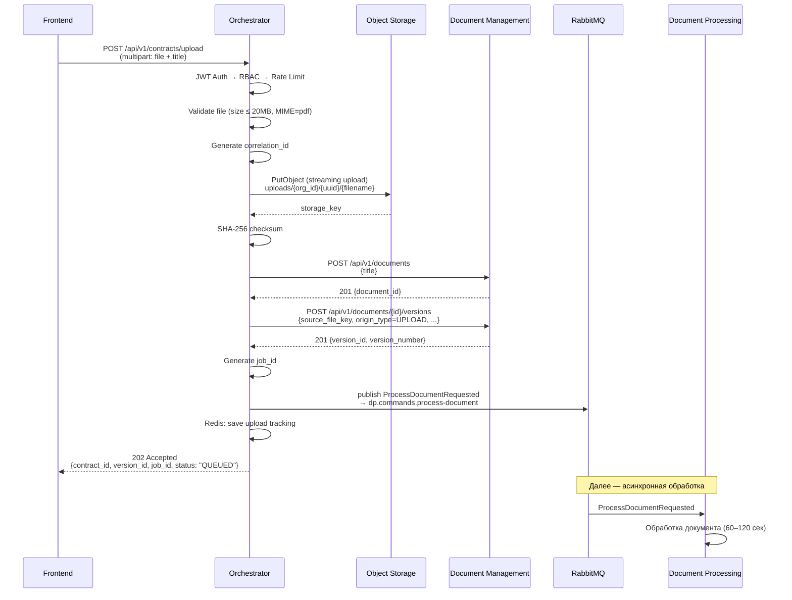
```mermaid
sequenceDiagram
    participant FE as Frontend
    participant ORCH as Orchestrator
    participant S3 as Object Storage
    participant DM as Document Management
    participant RMQ as RabbitMQ
    participant DP as Document Processing

    FE->>ORCH: POST /api/v1/contracts/upload<br/>(multipart: file + title)
    ORCH->>ORCH: JWT Auth → RBAC → Rate Limit
    ORCH->>ORCH: Validate file (size ≤ 20MB, MIME=pdf)
    ORCH->>ORCH: Generate correlation_id

    ORCH->>S3: PutObject (streaming upload)<br/>uploads/{org_id}/{uuid}/{filename}
    S3-->>ORCH: storage_key

    ORCH->>ORCH: SHA-256 checksum

    ORCH->>DM: POST /api/v1/documents<br/>{title}
    DM-->>ORCH: 201 {document_id}

    ORCH->>DM: POST /api/v1/documents/{id}/versions<br/>{source_file_key, origin_type=UPLOAD, ...}
    DM-->>ORCH: 201 {version_id, version_number}

    ORCH->>ORCH: Generate job_id
    ORCH->>RMQ: publish ProcessDocumentRequested<br/>→ dp.commands.process-document

    ORCH->>ORCH: Redis: save upload tracking

    ORCH-->>FE: 202 Accepted<br/>{contract_id, version_id, job_id, status: "QUEUED"}

    Note over RMQ,DP: Далее — асинхронная обработка
    RMQ->>DP: ProcessDocumentRequested
    DP->>DP: Обработка документа (60–120 сек)
```

### Альтернатива: ошибка загрузки в S3

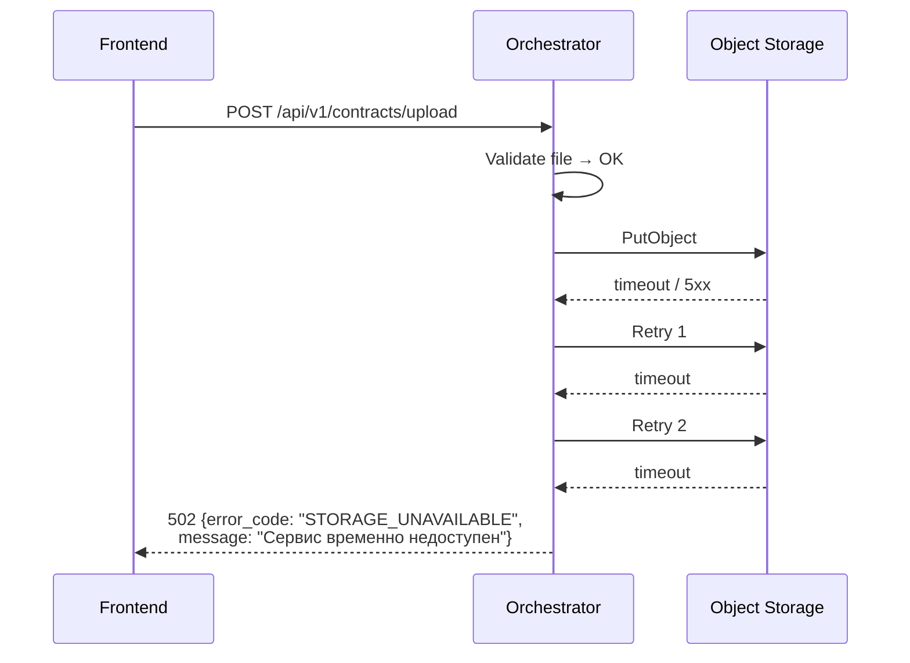
```mermaid
sequenceDiagram
    participant FE as Frontend
    participant ORCH as Orchestrator
    participant S3 as Object Storage

    FE->>ORCH: POST /api/v1/contracts/upload
    ORCH->>ORCH: Validate file → OK

    ORCH->>S3: PutObject
    S3-->>ORCH: timeout / 5xx

    ORCH->>S3: Retry 1
    S3-->>ORCH: timeout
    ORCH->>S3: Retry 2
    S3-->>ORCH: timeout

    ORCH-->>FE: 502 {error_code: "STORAGE_UNAVAILABLE",<br/>message: "Сервис временно недоступен"}
```

### Альтернатива: невалидный файл

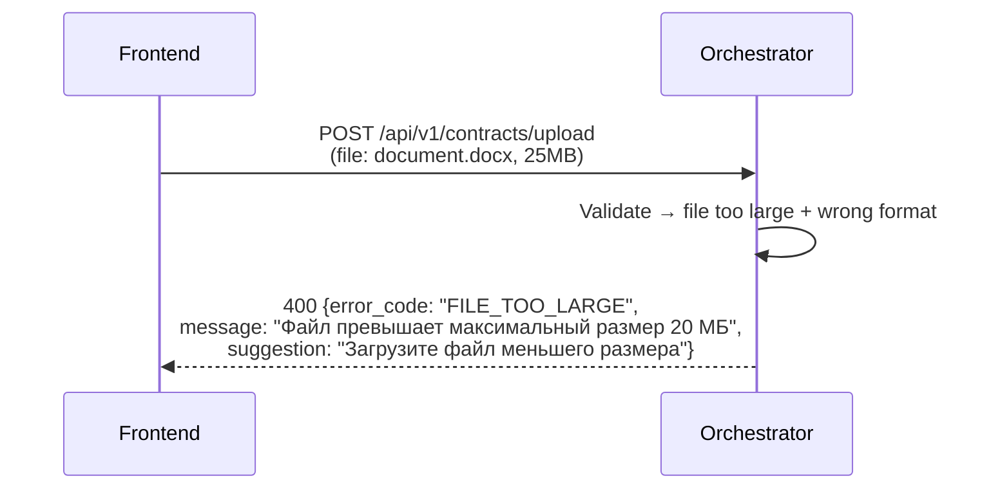
```mermaid
sequenceDiagram
    participant FE as Frontend
    participant ORCH as Orchestrator

    FE->>ORCH: POST /api/v1/contracts/upload<br/>(file: document.docx, 25MB)
    ORCH->>ORCH: Validate → file too large + wrong format

    ORCH-->>FE: 400 {error_code: "FILE_TOO_LARGE",<br/>message: "Файл превышает максимальный размер 20 МБ",<br/>suggestion: "Загрузите файл меньшего размера"}
```

---

## 8.2 Получение статуса обработки (SSE)

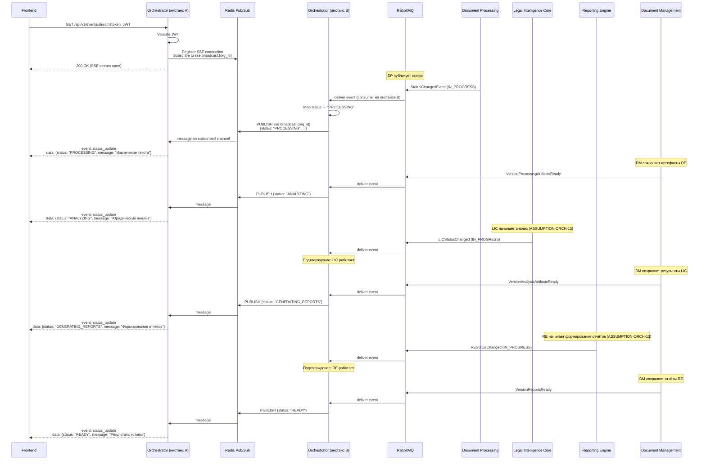
```mermaid
sequenceDiagram
    participant FE as Frontend
    participant ORCH_A as Orchestrator (инстанс A)
    participant Redis as Redis Pub/Sub
    participant ORCH_B as Orchestrator (инстанс B)
    participant RMQ as RabbitMQ
    participant DP as Document Processing
    participant LIC as Legal Intelligence Core
    participant RE as Reporting Engine
    participant DM as Document Management

    FE->>ORCH_A: GET /api/v1/events/stream?token=JWT
    ORCH_A->>ORCH_A: Validate JWT
    ORCH_A->>Redis: Register SSE connection<br/>Subscribe to sse:broadcast:{org_id}
    ORCH_A-->>FE: 200 OK (SSE stream open)

    Note over RMQ: DP публикует статус

    DP->>RMQ: StatusChangedEvent (IN_PROGRESS)
    RMQ->>ORCH_B: deliver event (consumer на инстансе B)
    ORCH_B->>ORCH_B: Map status → "PROCESSING"
    ORCH_B->>Redis: PUBLISH sse:broadcast:{org_id}<br/>{status: "PROCESSING", ...}
    Redis->>ORCH_A: message on subscribed channel
    ORCH_A-->>FE: event: status_update<br/>data: {status: "PROCESSING", message: "Извлечение текста"}

    Note over DM: DM сохраняет артефакты DP

    DM->>RMQ: VersionProcessingArtifactsReady
    RMQ->>ORCH_B: deliver event
    ORCH_B->>Redis: PUBLISH {status: "ANALYZING"}
    Redis->>ORCH_A: message
    ORCH_A-->>FE: event: status_update<br/>data: {status: "ANALYZING", message: "Юридический анализ"}

    Note over LIC: LIC начинает анализ (ASSUMPTION-ORCH-13)

    LIC->>RMQ: LICStatusChanged (IN_PROGRESS)
    RMQ->>ORCH_B: deliver event
    Note over ORCH_B: Подтверждение: LIC работает

    Note over DM: DM сохраняет результаты LIC

    DM->>RMQ: VersionAnalysisArtifactsReady
    RMQ->>ORCH_B: deliver event
    ORCH_B->>Redis: PUBLISH {status: "GENERATING_REPORTS"}
    Redis->>ORCH_A: message
    ORCH_A-->>FE: event: status_update<br/>data: {status: "GENERATING_REPORTS", message: "Формирование отчётов"}

    Note over RE: RE начинает формирование отчётов (ASSUMPTION-ORCH-13)

    RE->>RMQ: REStatusChanged (IN_PROGRESS)
    RMQ->>ORCH_B: deliver event
    Note over ORCH_B: Подтверждение: RE работает

    Note over DM: DM сохраняет отчёты RE

    DM->>RMQ: VersionReportsReady
    RMQ->>ORCH_B: deliver event
    ORCH_B->>Redis: PUBLISH {status: "READY"}
    Redis->>ORCH_A: message
    ORCH_A-->>FE: event: status_update<br/>data: {status: "READY", message: "Результаты готовы"}
```

### Polling fallback

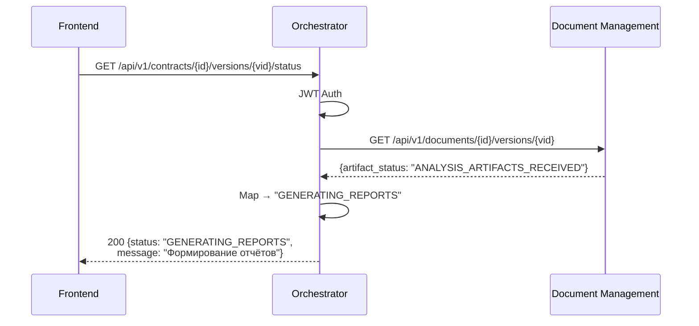
```mermaid
sequenceDiagram
    participant FE as Frontend
    participant ORCH as Orchestrator
    participant DM as Document Management

    FE->>ORCH: GET /api/v1/contracts/{id}/versions/{vid}/status
    ORCH->>ORCH: JWT Auth
    ORCH->>DM: GET /api/v1/documents/{id}/versions/{vid}
    DM-->>ORCH: {artifact_status: "ANALYSIS_ARTIFACTS_RECEIVED"}
    ORCH->>ORCH: Map → "GENERATING_REPORTS"
    ORCH-->>FE: 200 {status: "GENERATING_REPORTS",<br/>message: "Формирование отчётов"}
```

---

## 8.3 Получение результатов проверки (UR-4, UR-5, UR-6, UR-7)

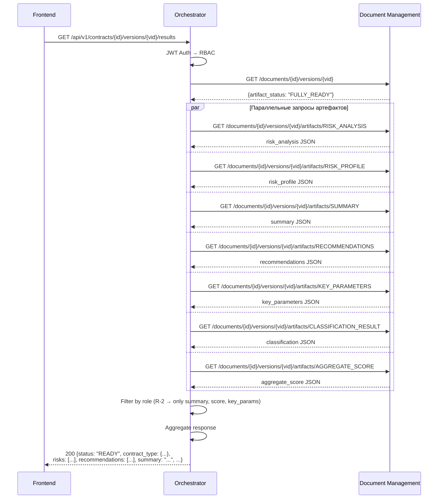
```mermaid
sequenceDiagram
    participant FE as Frontend
    participant ORCH as Orchestrator
    participant DM as Document Management

    FE->>ORCH: GET /api/v1/contracts/{id}/versions/{vid}/results
    ORCH->>ORCH: JWT Auth → RBAC

    ORCH->>DM: GET /documents/{id}/versions/{vid}
    DM-->>ORCH: {artifact_status: "FULLY_READY"}

    par Параллельные запросы артефактов
        ORCH->>DM: GET /documents/{id}/versions/{vid}/artifacts/RISK_ANALYSIS
        DM-->>ORCH: risk_analysis JSON
    and
        ORCH->>DM: GET /documents/{id}/versions/{vid}/artifacts/RISK_PROFILE
        DM-->>ORCH: risk_profile JSON
    and
        ORCH->>DM: GET /documents/{id}/versions/{vid}/artifacts/SUMMARY
        DM-->>ORCH: summary JSON
    and
        ORCH->>DM: GET /documents/{id}/versions/{vid}/artifacts/RECOMMENDATIONS
        DM-->>ORCH: recommendations JSON
    and
        ORCH->>DM: GET /documents/{id}/versions/{vid}/artifacts/KEY_PARAMETERS
        DM-->>ORCH: key_parameters JSON
    and
        ORCH->>DM: GET /documents/{id}/versions/{vid}/artifacts/CLASSIFICATION_RESULT
        DM-->>ORCH: classification JSON
    and
        ORCH->>DM: GET /documents/{id}/versions/{vid}/artifacts/AGGREGATE_SCORE
        DM-->>ORCH: aggregate_score JSON
    end

    ORCH->>ORCH: Filter by role (R-2 → only summary, score, key_params)
    ORCH->>ORCH: Aggregate response

    ORCH-->>FE: 200 {status: "READY", contract_type: {...},<br/>risks: [...], recommendations: [...], summary: "...", ...}
```

### Альтернатива: результаты ещё не готовы

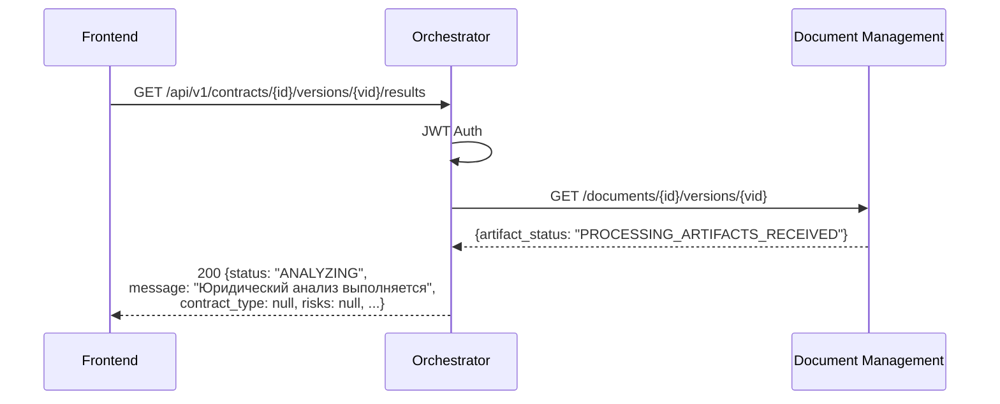
```mermaid
sequenceDiagram
    participant FE as Frontend
    participant ORCH as Orchestrator
    participant DM as Document Management

    FE->>ORCH: GET /api/v1/contracts/{id}/versions/{vid}/results
    ORCH->>ORCH: JWT Auth

    ORCH->>DM: GET /documents/{id}/versions/{vid}
    DM-->>ORCH: {artifact_status: "PROCESSING_ARTIFACTS_RECEIVED"}

    ORCH-->>FE: 200 {status: "ANALYZING",<br/>message: "Юридический анализ выполняется",<br/>contract_type: null, risks: null, ...}
```

---

## 8.4 Повторная проверка версии (UR-9)

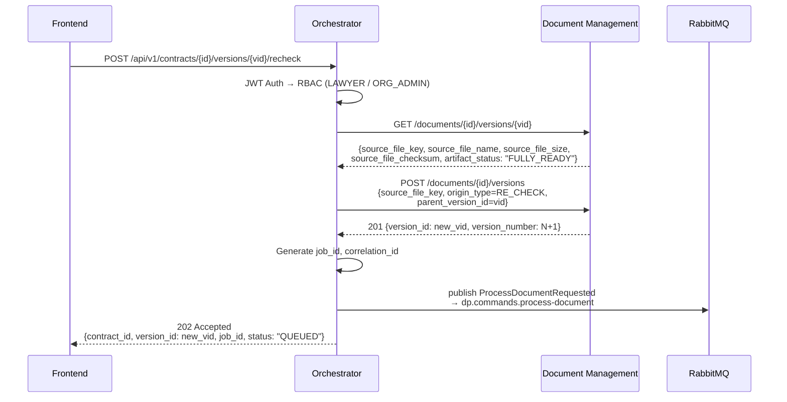
```mermaid
sequenceDiagram
    participant FE as Frontend
    participant ORCH as Orchestrator
    participant DM as Document Management
    participant RMQ as RabbitMQ

    FE->>ORCH: POST /api/v1/contracts/{id}/versions/{vid}/recheck
    ORCH->>ORCH: JWT Auth → RBAC (LAWYER / ORG_ADMIN)

    ORCH->>DM: GET /documents/{id}/versions/{vid}
    DM-->>ORCH: {source_file_key, source_file_name, source_file_size,<br/>source_file_checksum, artifact_status: "FULLY_READY"}

    ORCH->>DM: POST /documents/{id}/versions<br/>{source_file_key, origin_type=RE_CHECK,<br/>parent_version_id=vid}
    DM-->>ORCH: 201 {version_id: new_vid, version_number: N+1}

    ORCH->>ORCH: Generate job_id, correlation_id
    ORCH->>RMQ: publish ProcessDocumentRequested<br/>→ dp.commands.process-document

    ORCH-->>FE: 202 Accepted<br/>{contract_id, version_id: new_vid, job_id, status: "QUEUED"}
```

### Альтернатива: версия ещё обрабатывается

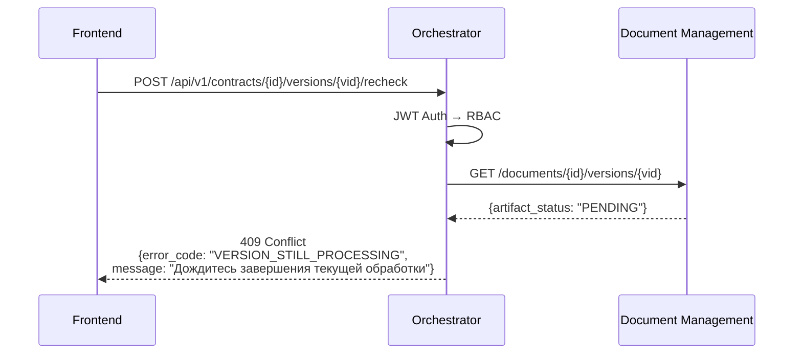
```mermaid
sequenceDiagram
    participant FE as Frontend
    participant ORCH as Orchestrator
    participant DM as Document Management

    FE->>ORCH: POST /api/v1/contracts/{id}/versions/{vid}/recheck
    ORCH->>ORCH: JWT Auth → RBAC

    ORCH->>DM: GET /documents/{id}/versions/{vid}
    DM-->>ORCH: {artifact_status: "PENDING"}

    ORCH-->>FE: 409 Conflict<br/>{error_code: "VERSION_STILL_PROCESSING",<br/>message: "Дождитесь завершения текущей обработки"}
```

---

## 8.5 Сравнение версий (FR-5.3.1)

### Запуск сравнения

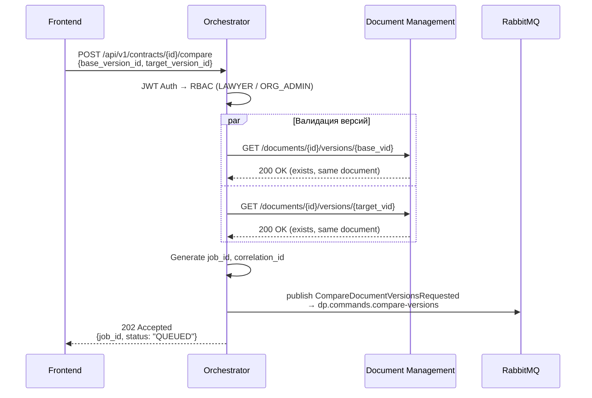
```mermaid
sequenceDiagram
    participant FE as Frontend
    participant ORCH as Orchestrator
    participant DM as Document Management
    participant RMQ as RabbitMQ

    FE->>ORCH: POST /api/v1/contracts/{id}/compare<br/>{base_version_id, target_version_id}
    ORCH->>ORCH: JWT Auth → RBAC (LAWYER / ORG_ADMIN)

    par Валидация версий
        ORCH->>DM: GET /documents/{id}/versions/{base_vid}
        DM-->>ORCH: 200 OK (exists, same document)
    and
        ORCH->>DM: GET /documents/{id}/versions/{target_vid}
        DM-->>ORCH: 200 OK (exists, same document)
    end

    ORCH->>ORCH: Generate job_id, correlation_id
    ORCH->>RMQ: publish CompareDocumentVersionsRequested<br/>→ dp.commands.compare-versions

    ORCH-->>FE: 202 Accepted<br/>{job_id, status: "QUEUED"}
```

### Получение результата

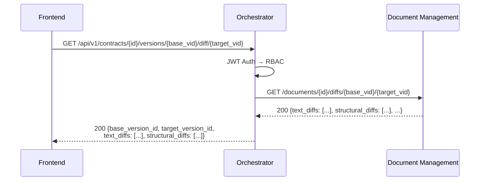
```mermaid
sequenceDiagram
    participant FE as Frontend
    participant ORCH as Orchestrator
    participant DM as Document Management

    FE->>ORCH: GET /api/v1/contracts/{id}/versions/{base_vid}/diff/{target_vid}
    ORCH->>ORCH: JWT Auth → RBAC

    ORCH->>DM: GET /documents/{id}/diffs/{base_vid}/{target_vid}
    DM-->>ORCH: 200 {text_diffs: [...], structural_diffs: [...], ...}

    ORCH-->>FE: 200 {base_version_id, target_version_id,<br/>text_diffs: [...], structural_diffs: [...]}
```

---

## 8.6 Экспорт отчёта (UR-10)

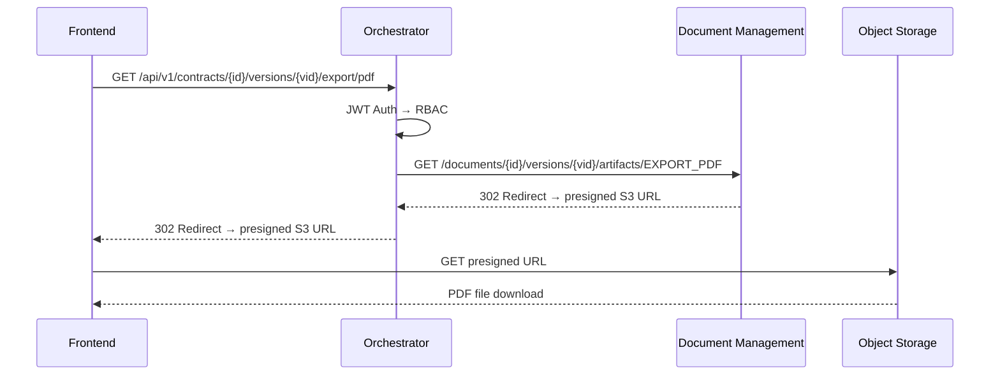
```mermaid
sequenceDiagram
    participant FE as Frontend
    participant ORCH as Orchestrator
    participant DM as Document Management
    participant S3 as Object Storage

    FE->>ORCH: GET /api/v1/contracts/{id}/versions/{vid}/export/pdf
    ORCH->>ORCH: JWT Auth → RBAC

    ORCH->>DM: GET /documents/{id}/versions/{vid}/artifacts/EXPORT_PDF
    DM-->>ORCH: 302 Redirect → presigned S3 URL

    ORCH-->>FE: 302 Redirect → presigned S3 URL

    FE->>S3: GET presigned URL
    S3-->>FE: PDF file download
```

### Альтернатива: отчёт не готов

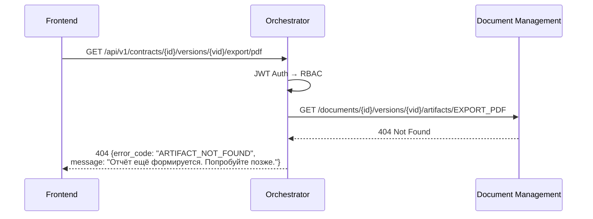
```mermaid
sequenceDiagram
    participant FE as Frontend
    participant ORCH as Orchestrator
    participant DM as Document Management

    FE->>ORCH: GET /api/v1/contracts/{id}/versions/{vid}/export/pdf
    ORCH->>ORCH: JWT Auth → RBAC

    ORCH->>DM: GET /documents/{id}/versions/{vid}/artifacts/EXPORT_PDF
    DM-->>ORCH: 404 Not Found

    ORCH-->>FE: 404 {error_code: "ARTIFACT_NOT_FOUND",<br/>message: "Отчёт ещё формируется. Попробуйте позже."}
```

---

## 8.7 Управление документами

### Список документов

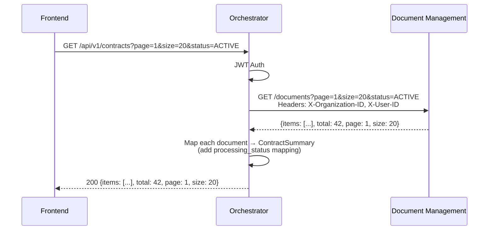
```mermaid
sequenceDiagram
    participant FE as Frontend
    participant ORCH as Orchestrator
    participant DM as Document Management

    FE->>ORCH: GET /api/v1/contracts?page=1&size=20&status=ACTIVE
    ORCH->>ORCH: JWT Auth

    ORCH->>DM: GET /documents?page=1&size=20&status=ACTIVE<br/>Headers: X-Organization-ID, X-User-ID
    DM-->>ORCH: {items: [...], total: 42, page: 1, size: 20}

    ORCH->>ORCH: Map each document → ContractSummary<br/>(add processing_status mapping)

    ORCH-->>FE: 200 {items: [...], total: 42, page: 1, size: 20}
```

### Архивация

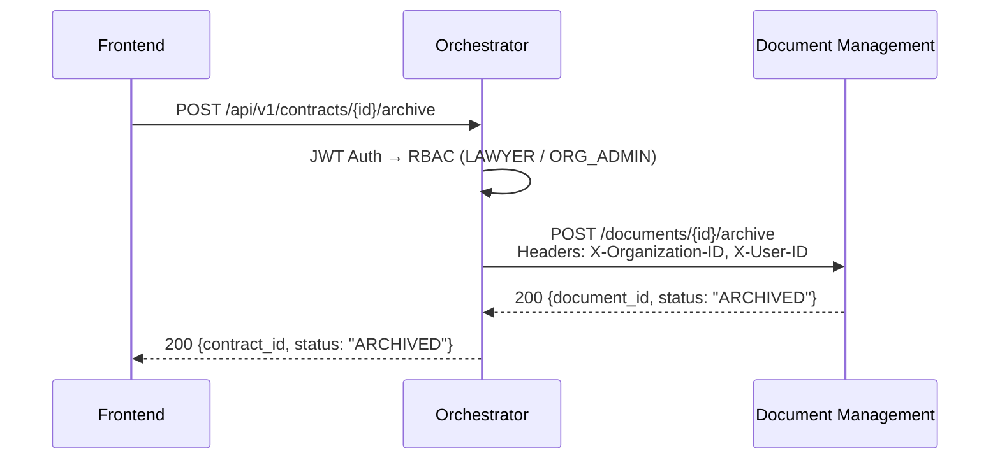
```mermaid
sequenceDiagram
    participant FE as Frontend
    participant ORCH as Orchestrator
    participant DM as Document Management

    FE->>ORCH: POST /api/v1/contracts/{id}/archive
    ORCH->>ORCH: JWT Auth → RBAC (LAWYER / ORG_ADMIN)

    ORCH->>DM: POST /documents/{id}/archive<br/>Headers: X-Organization-ID, X-User-ID
    DM-->>ORCH: 200 {document_id, status: "ARCHIVED"}

    ORCH-->>FE: 200 {contract_id, status: "ARCHIVED"}
```

---

## 8.8 Обратная связь (UR-11)

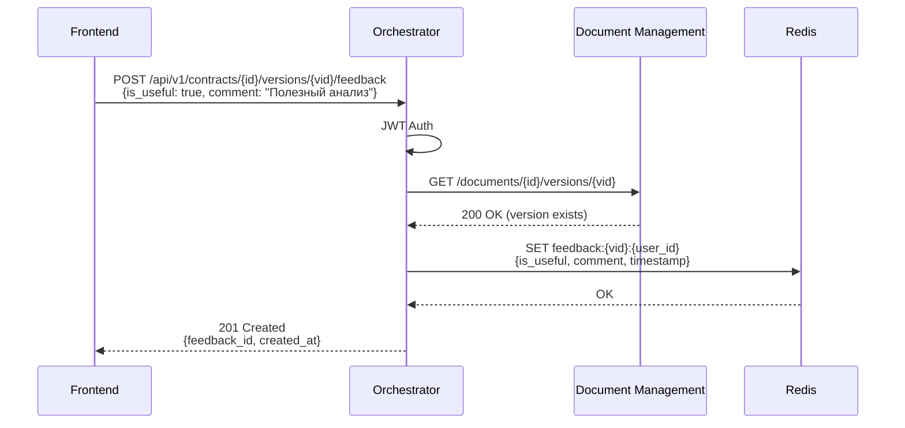
```mermaid
sequenceDiagram
    participant FE as Frontend
    participant ORCH as Orchestrator
    participant DM as Document Management
    participant Redis as Redis

    FE->>ORCH: POST /api/v1/contracts/{id}/versions/{vid}/feedback<br/>{is_useful: true, comment: "Полезный анализ"}
    ORCH->>ORCH: JWT Auth

    ORCH->>DM: GET /documents/{id}/versions/{vid}
    DM-->>ORCH: 200 OK (version exists)

    ORCH->>Redis: SET feedback:{vid}:{user_id}<br/>{is_useful, comment, timestamp}
    Redis-->>ORCH: OK

    ORCH-->>FE: 201 Created<br/>{feedback_id, created_at}
```

---

## 8.9 Настройка строгости администратором (UR-12)

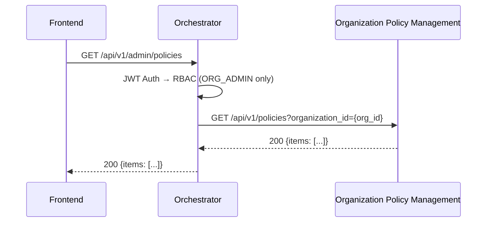
```mermaid
sequenceDiagram
    participant FE as Frontend
    participant ORCH as Orchestrator
    participant OPM as Organization Policy Management

    FE->>ORCH: GET /api/v1/admin/policies
    ORCH->>ORCH: JWT Auth → RBAC (ORG_ADMIN only)

    ORCH->>OPM: GET /api/v1/policies?organization_id={org_id}
    OPM-->>ORCH: 200 {items: [...]}

    ORCH-->>FE: 200 {items: [...]}
```

### Обновление чек-листа

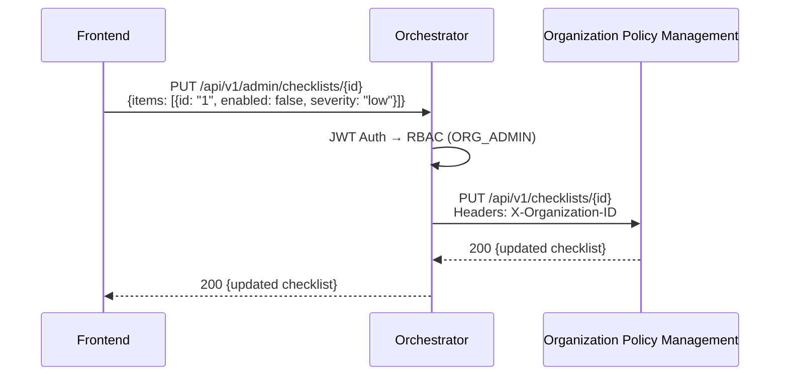
```mermaid
sequenceDiagram
    participant FE as Frontend
    participant ORCH as Orchestrator
    participant OPM as Organization Policy Management

    FE->>ORCH: PUT /api/v1/admin/checklists/{id}<br/>{items: [{id: "1", enabled: false, severity: "low"}]}
    ORCH->>ORCH: JWT Auth → RBAC (ORG_ADMIN)

    ORCH->>OPM: PUT /api/v1/checklists/{id}<br/>Headers: X-Organization-ID
    OPM-->>ORCH: 200 {updated checklist}

    ORCH-->>FE: 200 {updated checklist}
```

---

## 8.10 End-to-end: полный цикл обработки договора

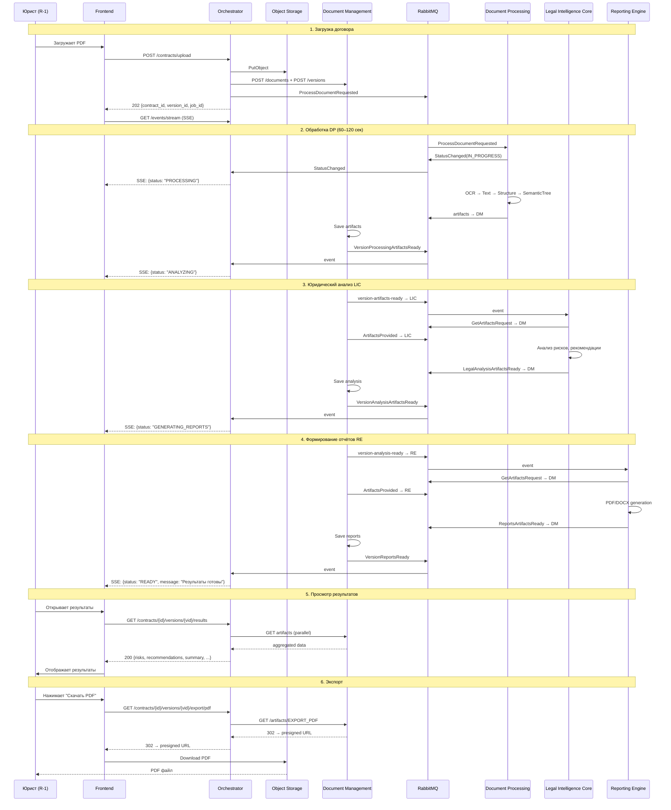
```mermaid
sequenceDiagram
    participant User as Юрист (R-1)
    participant FE as Frontend
    participant ORCH as Orchestrator
    participant S3 as Object Storage
    participant DM as Document Management
    participant RMQ as RabbitMQ
    participant DP as Document Processing
    participant LIC as Legal Intelligence Core
    participant RE as Reporting Engine

    Note over User,RE: 1. Загрузка договора

    User->>FE: Загружает PDF
    FE->>ORCH: POST /contracts/upload
    ORCH->>S3: PutObject
    ORCH->>DM: POST /documents + POST /versions
    ORCH->>RMQ: ProcessDocumentRequested
    ORCH-->>FE: 202 {contract_id, version_id, job_id}
    FE->>ORCH: GET /events/stream (SSE)

    Note over User,RE: 2. Обработка DP (60–120 сек)

    RMQ->>DP: ProcessDocumentRequested
    DP->>RMQ: StatusChanged(IN_PROGRESS)
    RMQ->>ORCH: StatusChanged
    ORCH-->>FE: SSE: {status: "PROCESSING"}

    DP->>DP: OCR → Text → Structure → SemanticTree
    DP->>RMQ: artifacts → DM
    DM->>DM: Save artifacts
    DM->>RMQ: VersionProcessingArtifactsReady
    RMQ->>ORCH: event
    ORCH-->>FE: SSE: {status: "ANALYZING"}

    Note over User,RE: 3. Юридический анализ LIC

    DM->>RMQ: version-artifacts-ready → LIC
    RMQ->>LIC: event
    LIC->>RMQ: GetArtifactsRequest → DM
    DM->>RMQ: ArtifactsProvided → LIC
    LIC->>LIC: Анализ рисков, рекомендации
    LIC->>RMQ: LegalAnalysisArtifactsReady → DM
    DM->>DM: Save analysis
    DM->>RMQ: VersionAnalysisArtifactsReady
    RMQ->>ORCH: event
    ORCH-->>FE: SSE: {status: "GENERATING_REPORTS"}

    Note over User,RE: 4. Формирование отчётов RE

    DM->>RMQ: version-analysis-ready → RE
    RMQ->>RE: event
    RE->>RMQ: GetArtifactsRequest → DM
    DM->>RMQ: ArtifactsProvided → RE
    RE->>RE: PDF/DOCX generation
    RE->>RMQ: ReportsArtifactsReady → DM
    DM->>DM: Save reports
    DM->>RMQ: VersionReportsReady
    RMQ->>ORCH: event
    ORCH-->>FE: SSE: {status: "READY", message: "Результаты готовы"}

    Note over User,RE: 5. Просмотр результатов

    User->>FE: Открывает результаты
    FE->>ORCH: GET /contracts/{id}/versions/{vid}/results
    ORCH->>DM: GET artifacts (parallel)
    DM-->>ORCH: aggregated data
    ORCH-->>FE: 200 {risks, recommendations, summary, ...}
    FE->>User: Отображает результаты

    Note over User,RE: 6. Экспорт

    User->>FE: Нажимает "Скачать PDF"
    FE->>ORCH: GET /contracts/{id}/versions/{vid}/export/pdf
    ORCH->>DM: GET /artifacts/EXPORT_PDF
    DM-->>ORCH: 302 → presigned URL
    ORCH-->>FE: 302 → presigned URL
    FE->>S3: Download PDF
    S3-->>User: PDF файл
```

---

## 8.11 Ошибка обработки (DP failed)

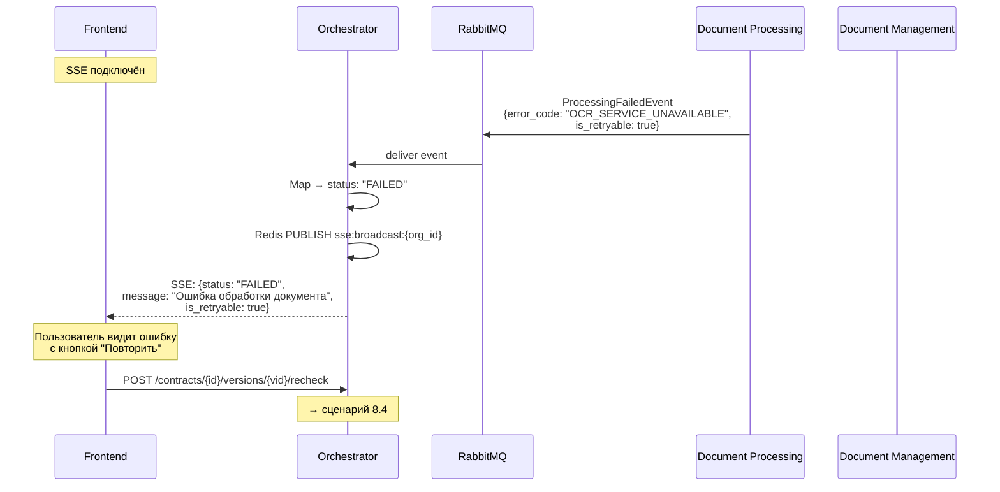
```mermaid
sequenceDiagram
    participant FE as Frontend
    participant ORCH as Orchestrator
    participant RMQ as RabbitMQ
    participant DP as Document Processing
    participant DM as Document Management

    Note over FE: SSE подключён

    DP->>RMQ: ProcessingFailedEvent<br/>{error_code: "OCR_SERVICE_UNAVAILABLE",<br/>is_retryable: true}
    RMQ->>ORCH: deliver event

    ORCH->>ORCH: Map → status: "FAILED"
    ORCH->>ORCH: Redis PUBLISH sse:broadcast:{org_id}
    ORCH-->>FE: SSE: {status: "FAILED",<br/>message: "Ошибка обработки документа",<br/>is_retryable: true}

    Note over FE: Пользователь видит ошибку<br/>с кнопкой "Повторить"

    FE->>ORCH: POST /contracts/{id}/versions/{vid}/recheck
    Note over ORCH: → сценарий 8.4
```

---

## 8.12 Ошибка LIC — мгновенное обнаружение (ASSUMPTION-ORCH-13)

```mermaid
sequenceDiagram
    participant FE as Frontend
    participant ORCH as Orchestrator
    participant RMQ as RabbitMQ
    participant LIC as Legal Intelligence Core
    participant DM as Document Management

    Note over FE: SSE подключён, статус: ANALYZING

    LIC->>RMQ: LICStatusChanged<br/>{status: "FAILED",<br/>error_code: "MODEL_UNAVAILABLE",<br/>error_message: "ML-модель недоступна",<br/>is_retryable: true}
    RMQ->>ORCH: deliver event

    ORCH->>ORCH: Map → status: "ANALYSIS_FAILED"
    ORCH->>ORCH: Redis PUBLISH sse:broadcast:{org_id}
    ORCH-->>FE: SSE: {status: "ANALYSIS_FAILED",<br/>message: "Ошибка юридического анализа",<br/>is_retryable: true}

    Note over FE: Пользователь видит ошибку<br/>за секунды, а не через 30 мин

    Note over DM: DM Watchdog (safety net):<br/>через 10 мин переведёт версию<br/>в PARTIALLY_AVAILABLE,<br/>если LIC не отправил результат
```

---

## 8.13 Тихий сбой LIC — обнаружение через DM Watchdog (ASSUMPTION-ORCH-14)

```mermaid
sequenceDiagram
    participant FE as Frontend
    participant ORCH as Orchestrator
    participant RMQ as RabbitMQ
    participant LIC as Legal Intelligence Core
    participant DM as Document Management

    Note over FE: SSE подключён, статус: ANALYZING
    Note over LIC: LIC упал (crash),<br/>не успев отправить событие

    Note over DM: Проходит 10 мин...<br/>DM Watchdog: версия застряла<br/>в PROCESSING_ARTIFACTS_RECEIVED

    DM->>DM: artifact_status → PARTIALLY_AVAILABLE
    DM->>RMQ: VersionPartiallyAvailable

    RMQ->>ORCH: deliver event
    ORCH->>ORCH: Map → status: "PARTIALLY_FAILED"
    ORCH-->>FE: SSE: {status: "PARTIALLY_FAILED",<br/>message: "Часть анализа не была завершена"}
```

---

## 8.14 Частичная доступность (PARTIALLY_AVAILABLE)

```mermaid
sequenceDiagram
    participant FE as Frontend
    participant ORCH as Orchestrator
    participant RMQ as RabbitMQ
    participant DM as Document Management

    DM->>RMQ: VersionPartiallyAvailable<br/>{document_id, version_id, org_id}
    RMQ->>ORCH: deliver event

    ORCH->>ORCH: Map → status: "PARTIALLY_FAILED"
    ORCH-->>FE: SSE: {status: "PARTIALLY_FAILED",<br/>message: "Часть анализа не была завершена"}

    Note over FE: Пользователь запрашивает<br/>доступные результаты

    FE->>ORCH: GET /contracts/{id}/versions/{vid}/results
    ORCH->>DM: GET artifacts (parallel)
    Note over DM: Некоторые артефакты доступны,<br/>некоторые возвращают 404

    ORCH-->>FE: 200 {status: "PARTIALLY_FAILED",<br/>summary: "...", risks: null,<br/>error: "Часть анализа не была завершена"}
```
