# Sequence Diagrams — Document Management

Диаграммы последовательности для каждого сценария из раздела 8 high-architecture.md. Формат: Mermaid.

---

## 8.1 Сохранение артефактов после обработки документа

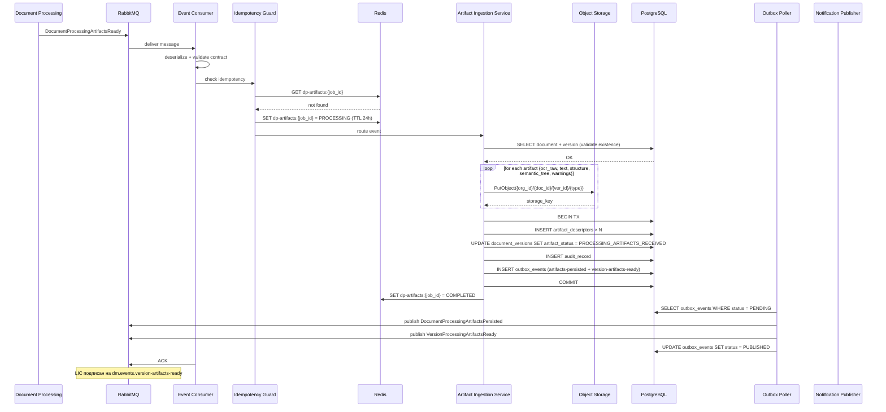

### Альтернатива: документ не найден

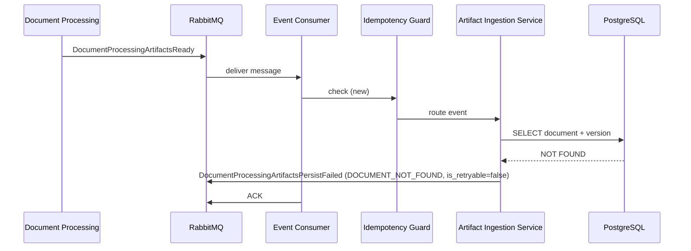

### Альтернатива: Object Storage недоступен

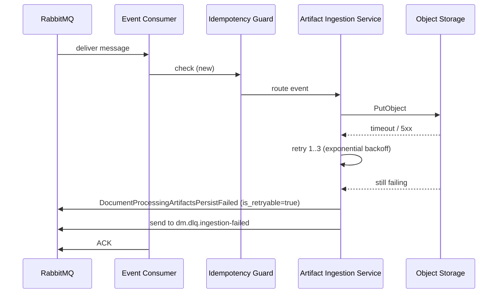

---

## 8.2 Создание новой версии документа

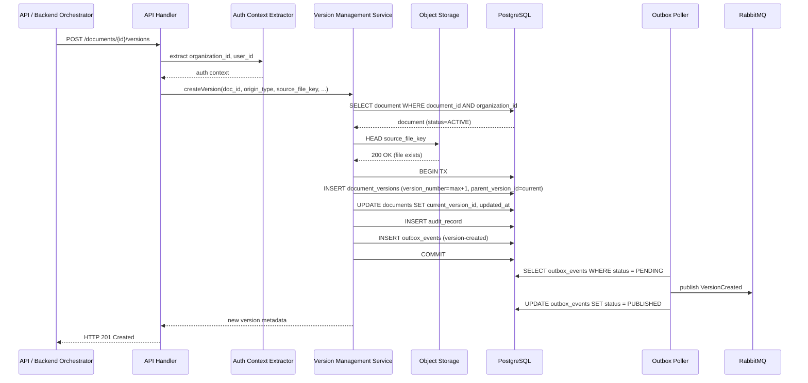

### Альтернатива: конфликт версии (race condition)

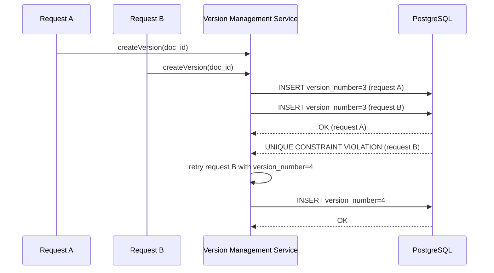

---

## 8.3 Выдача semantic tree для сравнения версий

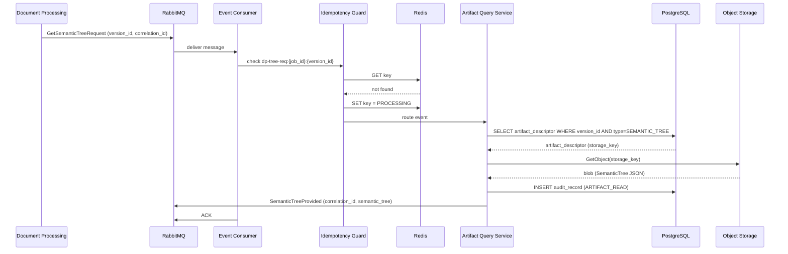

### Альтернатива: версия или артефакт не найдены

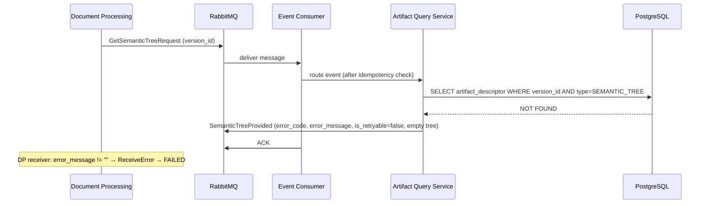

---

## 8.4 Сохранение результата сравнения версий

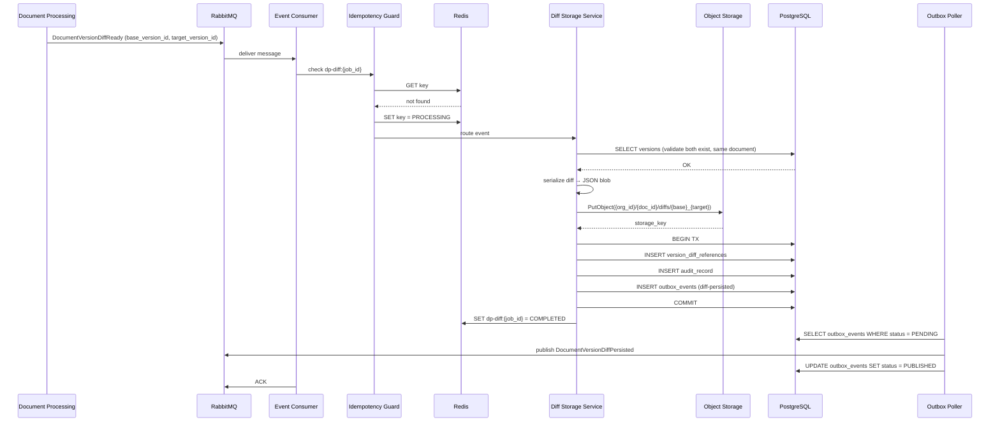

---

## 8.5 Сохранение результатов LIC

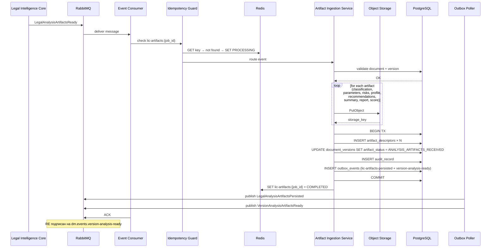

---

## 8.6 Сохранение результатов Reporting Engine

### Получение артефактов для формирования отчёта (RE ← DM)

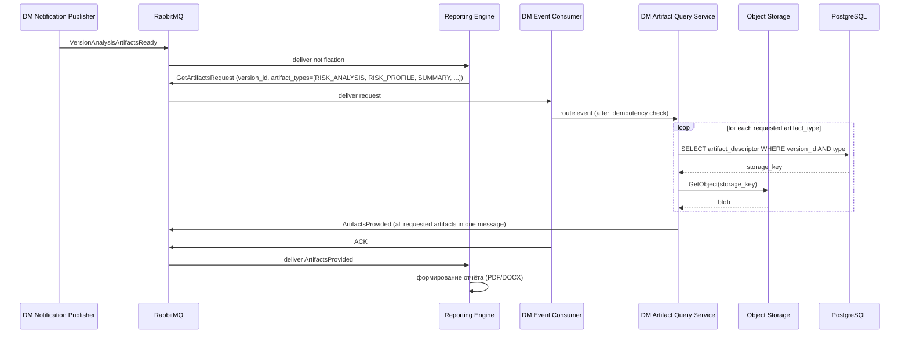

### Сохранение экспортных артефактов (RE → DM)

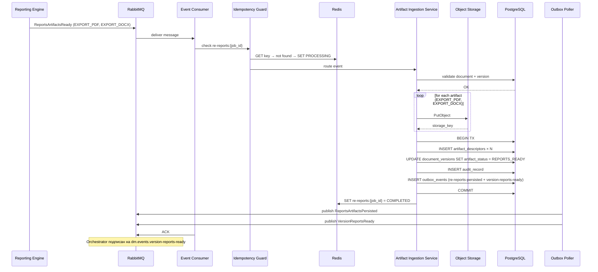

---

## 8.7 Получение артефактов для API / UI

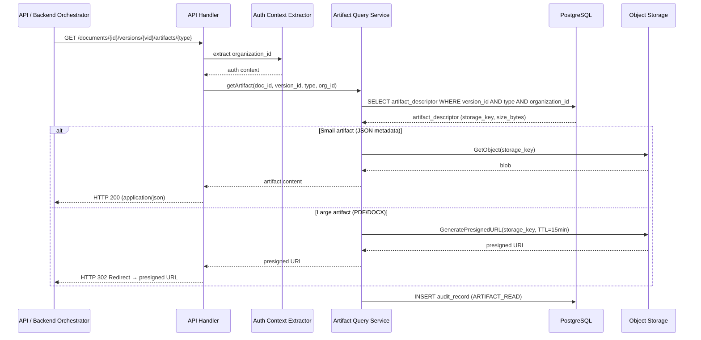

---

## 8.8 Повторная доставка одного и того же события

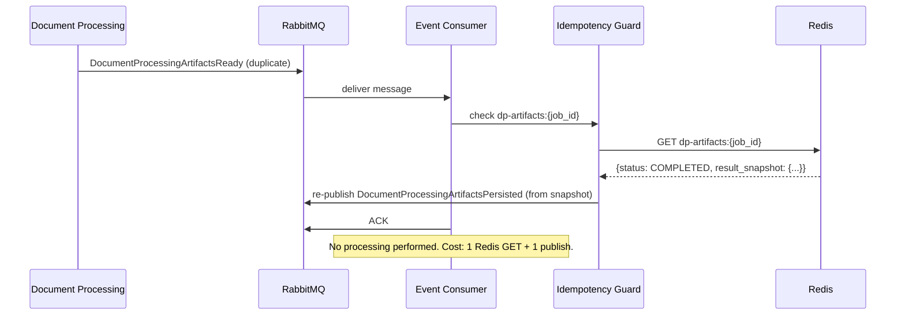

---

## 8.9 Ошибка частичного сохранения

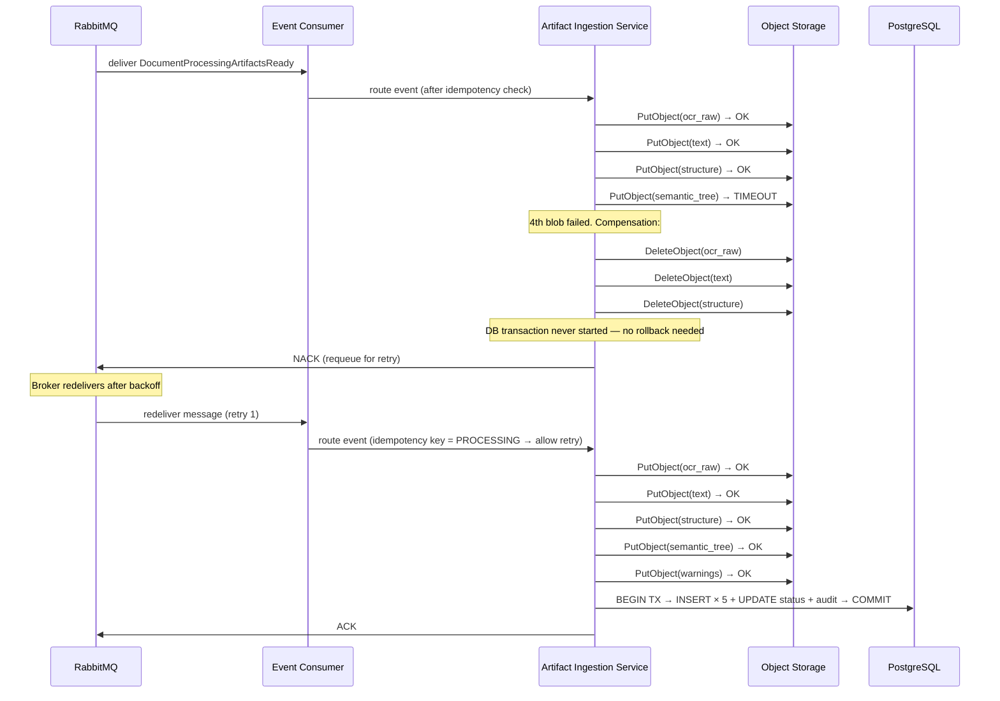

### Альтернатива: retry исчерпан

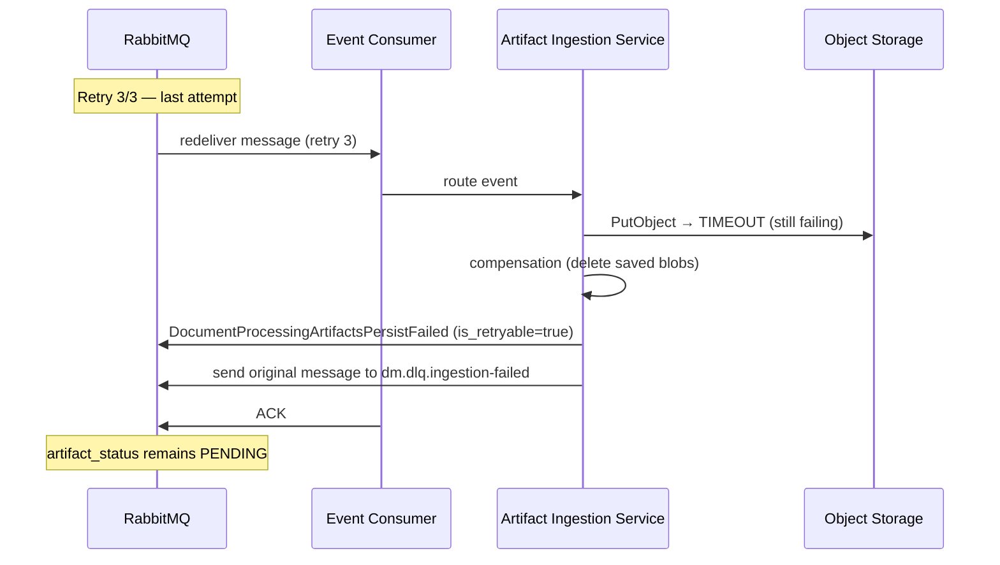

---

## 8.10 Конфликт версии

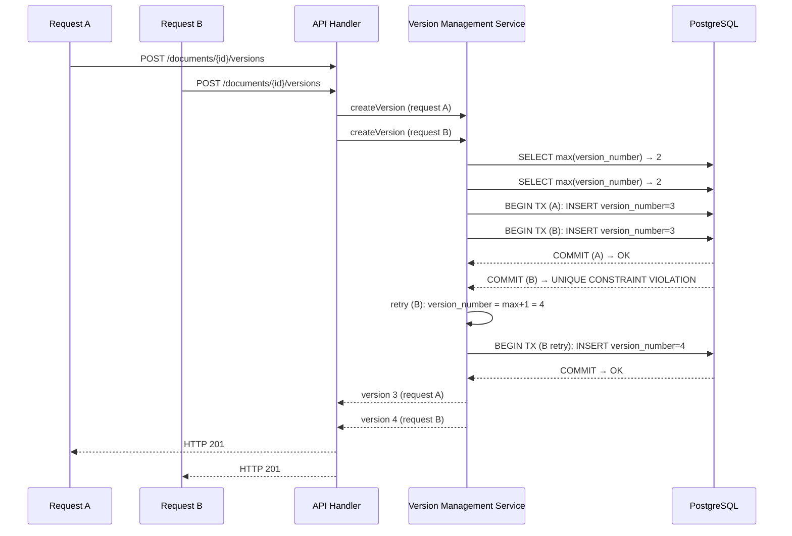

### Альтернатива: retry исчерпан

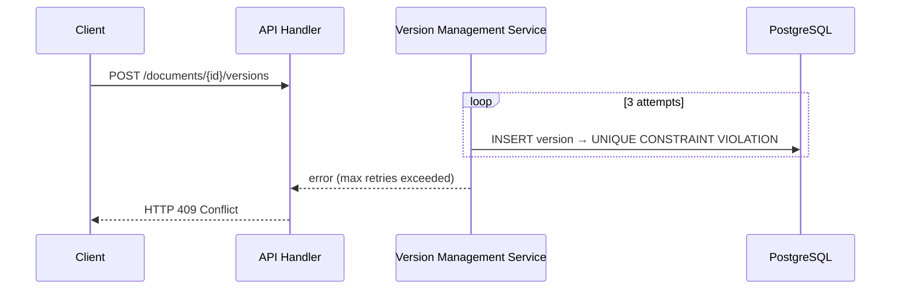

---

## 8.11 Таймаут или недоступность зависимого хранилища

### PostgreSQL недоступен (sync API)

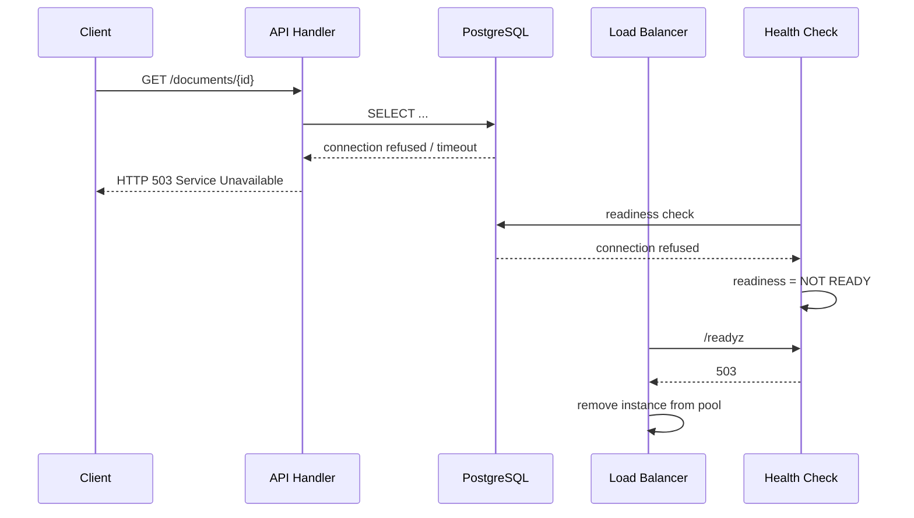

### PostgreSQL недоступен (async)

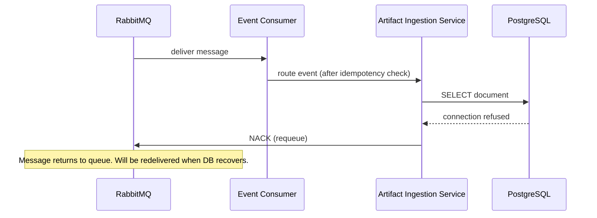

### Redis недоступен

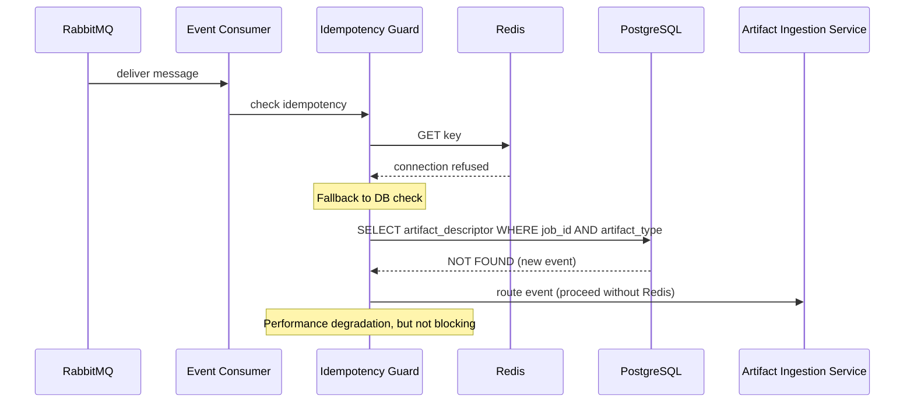
