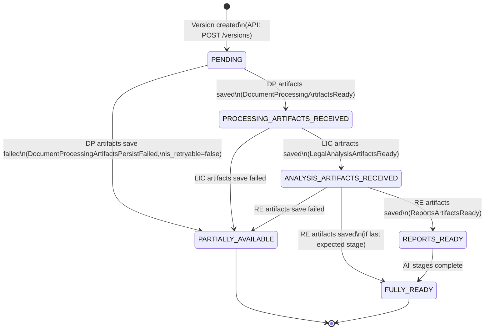
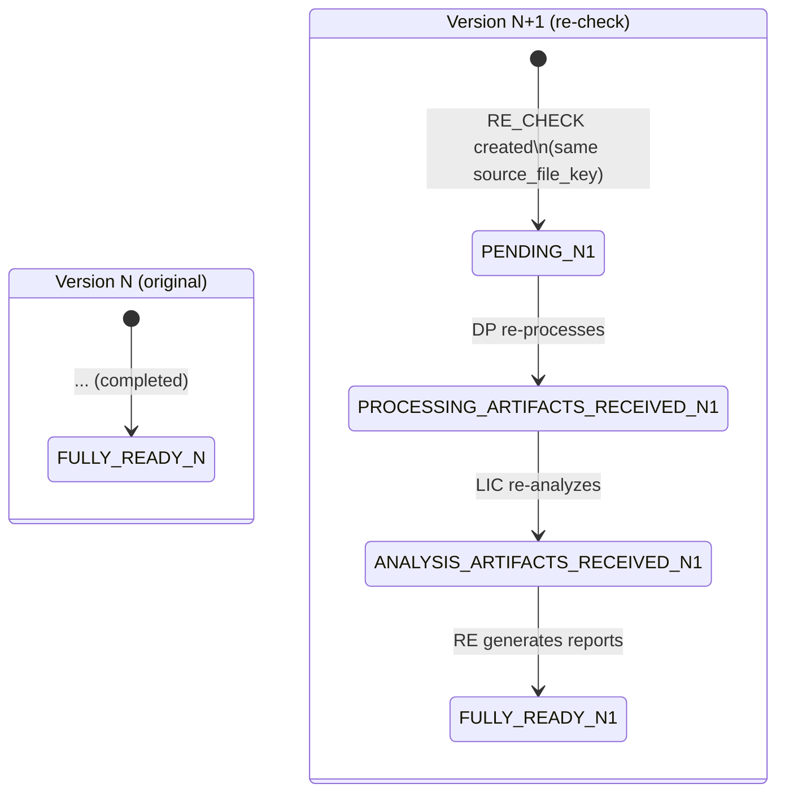

# State Machine — DocumentVersion.artifact_status

Диаграмма переходов статуса `artifact_status` для сущности `DocumentVersion`.

---

## Состояния

| Статус | Описание |
|--------|----------|
| `PENDING` | Версия создана, артефакты ещё не получены |
| `PROCESSING_ARTIFACTS_RECEIVED` | Артефакты DP сохранены |
| `ANALYSIS_ARTIFACTS_RECEIVED` | Результаты LIC сохранены |
| `REPORTS_READY` | Отчёты RE сохранены |
| `FULLY_READY` | Все ожидаемые артефакты получены |
| `PARTIALLY_AVAILABLE` | Часть артефактов доступна, часть — с ошибкой |

---

## Диаграмма переходов



---

## Правила переходов

### Инварианты

1. Переходы **только вперёд** — обратные переходы запрещены.
2. `PENDING` — начальное состояние, устанавливается при создании версии.
3. Каждый переход инициируется успешным сохранением артефактов от конкретного домена.
4. `PARTIALLY_AVAILABLE` — терминальное состояние ошибки, достижимо из любого промежуточного состояния.
5. `FULLY_READY` — терминальное состояние успеха.

### Таблица переходов

| Из | В | Триггер | Событие |
|----|---|---------|---------|
| `PENDING` | `PROCESSING_ARTIFACTS_RECEIVED` | Artifact Ingestion Service сохранил артефакты DP | `DocumentProcessingArtifactsReady` |
| `PENDING` | `PARTIALLY_AVAILABLE` | Ошибка сохранения артефактов DP (non-retryable) | `DocumentProcessingArtifactsPersistFailed` |
| `PROCESSING_ARTIFACTS_RECEIVED` | `ANALYSIS_ARTIFACTS_RECEIVED` | Artifact Ingestion Service сохранил артефакты LIC | `LegalAnalysisArtifactsReady` |
| `PROCESSING_ARTIFACTS_RECEIVED` | `PARTIALLY_AVAILABLE` | Ошибка сохранения артефактов LIC (non-retryable) | `LegalAnalysisArtifactsPersistFailed` |
| `ANALYSIS_ARTIFACTS_RECEIVED` | `REPORTS_READY` | Artifact Ingestion Service сохранил артефакты RE | `ReportsArtifactsReady` |
| `ANALYSIS_ARTIFACTS_RECEIVED` | `FULLY_READY` | Артефакты RE сохранены и это последний ожидаемый этап | `ReportsArtifactsReady` |
| `ANALYSIS_ARTIFACTS_RECEIVED` | `PARTIALLY_AVAILABLE` | Ошибка сохранения артефактов RE (non-retryable) | `ReportsArtifactsPersistFailed` |
| `REPORTS_READY` | `FULLY_READY` | Все этапы завершены | Внутренняя проверка completeness |

### Валидация переходов

Artifact Ingestion Service при обновлении `artifact_status` проверяет допустимость перехода:

```
allowed_transitions = {
    PENDING:                         [PROCESSING_ARTIFACTS_RECEIVED, PARTIALLY_AVAILABLE],
    PROCESSING_ARTIFACTS_RECEIVED:   [ANALYSIS_ARTIFACTS_RECEIVED, PARTIALLY_AVAILABLE],
    ANALYSIS_ARTIFACTS_RECEIVED:     [REPORTS_READY, FULLY_READY, PARTIALLY_AVAILABLE],
    REPORTS_READY:                   [FULLY_READY, PARTIALLY_AVAILABLE],
    FULLY_READY:                     [],  // terminal
    PARTIALLY_AVAILABLE:             [],  // terminal
}
```

Попытка недопустимого перехода → логирование WARN + игнорирование (идемпотентность: повторное событие не должно ломать состояние).

---

## Notifications при переходах

| Переход | Notification event | Потребитель |
|---------|--------------------|-------------|
| → `PROCESSING_ARTIFACTS_RECEIVED` | `dm.events.version-artifacts-ready` | LIC |
| → `ANALYSIS_ARTIFACTS_RECEIVED` | `dm.events.version-analysis-ready` | RE |
| → `REPORTS_READY` / `FULLY_READY` | `dm.events.version-reports-ready` | Orchestrator |
| → `PARTIALLY_AVAILABLE` | `dm.events.version-partially-available` | Orchestrator |

---

## RE_CHECK: повторная проверка

При `origin_type=RE_CHECK` создаётся **новая версия** с `artifact_status=PENDING`. Старая версия не затрагивается — её `artifact_status` остаётся в терминальном состоянии. State machine работает для новой версии с нуля.



---

## Stale Version Watchdog (REV-008, BRE-010)

Фоновый процесс, отслеживающий версии в промежуточных состояниях дольше допустимого таймаута.

**Конфигурация:** `DM_STALE_VERSION_TIMEOUT` (default 30 мин).

**Логика:**
1. Периодически (каждые 5 мин) `SELECT version_id, artifact_status, updated_at FROM document_versions WHERE artifact_status NOT IN ('FULLY_READY', 'PARTIALLY_AVAILABLE') AND updated_at < now() - interval`.
2. Для каждой найденной версии: `UPDATE artifact_status = 'PARTIALLY_AVAILABLE'` + audit record.
3. Публикация `dm.events.version-partially-available` через outbox.
4. Метрика `dm_stuck_versions_total` (counter) + `dm_stuck_versions_count` (gauge).
5. Алерт при `dm_stuck_versions_count > 0`.
