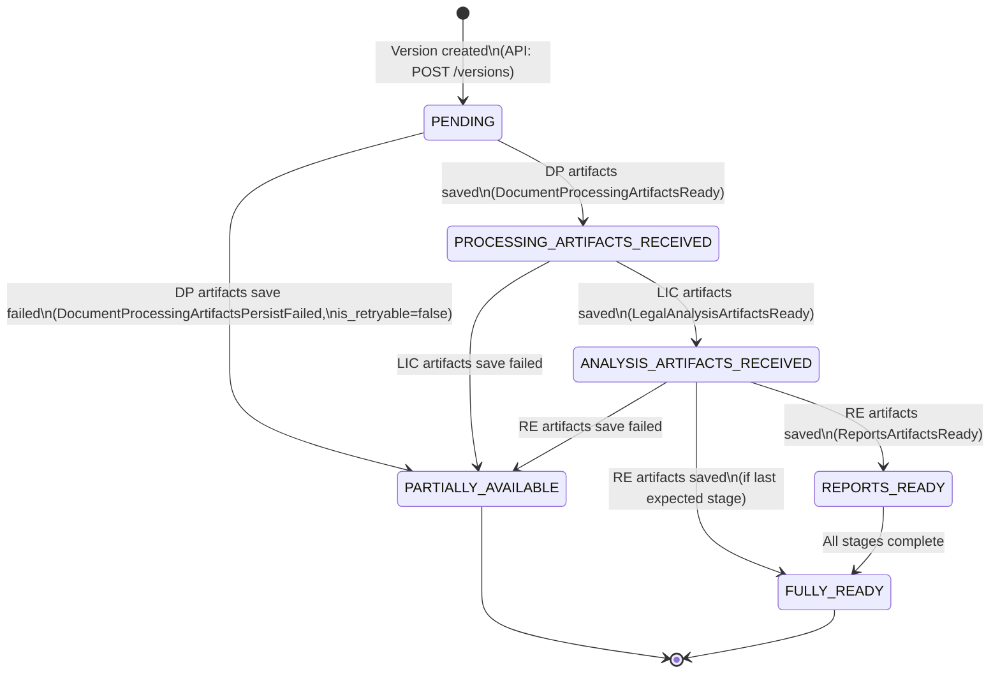
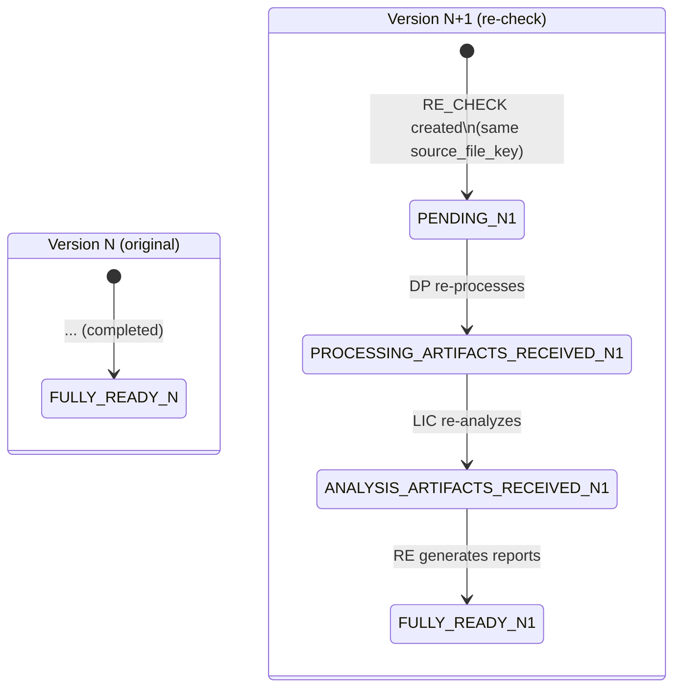

# State Machine — DocumentVersion.artifact_status

Диаграмма переходов статуса `artifact_status` для сущности `DocumentVersion`.

---

## Состояния

| Статус | Описание |
|--------|----------|
| `PENDING` | Версия создана, артефакты ещё не получены |
| `PROCESSING_ARTIFACTS_RECEIVED` | Артефакты DP сохранены |
| `ANALYSIS_ARTIFACTS_RECEIVED` | Результаты LIC сохранены |
| `REPORTS_READY` | Отчёты RE сохранены |
| `FULLY_READY` | Все ожидаемые артефакты получены |
| `PARTIALLY_AVAILABLE` | Часть артефактов доступна, часть — с ошибкой |

---

## Диаграмма переходов



---

## Правила переходов

### Инварианты

1. Переходы **только вперёд** — обратные переходы запрещены.
2. `PENDING` — начальное состояние, устанавливается при создании версии.
3. Каждый переход инициируется успешным сохранением артефактов от конкретного домена.
4. `PARTIALLY_AVAILABLE` — терминальное состояние ошибки, достижимо из любого промежуточного состояния.
5. `FULLY_READY` — терминальное состояние успеха.

### Таблица переходов

| Из | В | Триггер | Событие |
|----|---|---------|---------|
| `PENDING` | `PROCESSING_ARTIFACTS_RECEIVED` | Artifact Ingestion Service сохранил артефакты DP | `DocumentProcessingArtifactsReady` |
| `PENDING` | `PARTIALLY_AVAILABLE` | Ошибка сохранения артефактов DP (non-retryable) | `DocumentProcessingArtifactsPersistFailed` |
| `PROCESSING_ARTIFACTS_RECEIVED` | `ANALYSIS_ARTIFACTS_RECEIVED` | Artifact Ingestion Service сохранил артефакты LIC | `LegalAnalysisArtifactsReady` |
| `PROCESSING_ARTIFACTS_RECEIVED` | `PARTIALLY_AVAILABLE` | Ошибка сохранения артефактов LIC (non-retryable) | `LegalAnalysisArtifactsPersistFailed` |
| `ANALYSIS_ARTIFACTS_RECEIVED` | `REPORTS_READY` | Artifact Ingestion Service сохранил артефакты RE | `ReportsArtifactsReady` |
| `ANALYSIS_ARTIFACTS_RECEIVED` | `FULLY_READY` | Артефакты RE сохранены и это последний ожидаемый этап | `ReportsArtifactsReady` |
| `ANALYSIS_ARTIFACTS_RECEIVED` | `PARTIALLY_AVAILABLE` | Ошибка сохранения артефактов RE (non-retryable) | `ReportsArtifactsPersistFailed` |
| `REPORTS_READY` | `FULLY_READY` | Все этапы завершены | Внутренняя проверка completeness |

### Валидация переходов

Artifact Ingestion Service при обновлении `artifact_status` проверяет допустимость перехода:

```
allowed_transitions = {
    PENDING:                         [PROCESSING_ARTIFACTS_RECEIVED, PARTIALLY_AVAILABLE],
    PROCESSING_ARTIFACTS_RECEIVED:   [ANALYSIS_ARTIFACTS_RECEIVED, PARTIALLY_AVAILABLE],
    ANALYSIS_ARTIFACTS_RECEIVED:     [REPORTS_READY, FULLY_READY, PARTIALLY_AVAILABLE],
    REPORTS_READY:                   [FULLY_READY, PARTIALLY_AVAILABLE],
    FULLY_READY:                     [],  // terminal
    PARTIALLY_AVAILABLE:             [],  // terminal
}
```

Попытка недопустимого перехода → логирование WARN + игнорирование (идемпотентность: повторное событие не должно ломать состояние).

---

## Notifications при переходах

| Переход | Notification event | Потребитель |
|---------|--------------------|-------------|
| → `PROCESSING_ARTIFACTS_RECEIVED` | `dm.events.version-artifacts-ready` | LIC |
| → `ANALYSIS_ARTIFACTS_RECEIVED` | `dm.events.version-analysis-ready` | RE |
| → `REPORTS_READY` / `FULLY_READY` | `dm.events.version-reports-ready` | Orchestrator |
| → `PARTIALLY_AVAILABLE` | `dm.events.version-partially-available` | Orchestrator |

---

## RE_CHECK: повторная проверка

При `origin_type=RE_CHECK` создаётся **новая версия** с `artifact_status=PENDING`. Старая версия не затрагивается — её `artifact_status` остаётся в терминальном состоянии. State machine работает для новой версии с нуля.



---

## Stale Version Watchdog (REV-008, BRE-010, DM-TASK-053)

Фоновый процесс, отслеживающий версии в промежуточных состояниях дольше допустимого **per-stage** таймаута (ASSUMPTION-ORCH-14). Watchdog выступает safety net на случай тихого сбоя LIC/RE (crash без публикации status-changed события).

**Конфигурация (DM-TASK-053):** per-stage таймауты вместо единого глобального.

| Переход                                                   | Env var                          | Default |
|-----------------------------------------------------------|----------------------------------|---------|
| `PENDING → PROCESSING_ARTIFACTS_RECEIVED`                 | `DM_STALE_TIMEOUT_PROCESSING`    | `5m`    |
| `PROCESSING_ARTIFACTS_RECEIVED → ANALYSIS_ARTIFACTS_RECEIVED` | `DM_STALE_TIMEOUT_ANALYSIS`  | `10m`   |
| `ANALYSIS_ARTIFACTS_RECEIVED → REPORTS_READY`             | `DM_STALE_TIMEOUT_REPORTS`       | `5m`    |
| `REPORTS_READY → FULLY_READY`                             | `DM_STALE_TIMEOUT_FINALIZATION`  | `5m`    |

Legacy `DM_STALE_VERSION_TIMEOUT` сохранён как per-variable fallback: если per-stage переменная не задана — берётся значение этого параметра; если и он не задан — используется собственный default стадии. Смешанные конфигурации поддерживаются.

**Sampling lag.** Scan interval `DM_WATCHDOG_SCAN_INTERVAL` (default `5m`) + per-stage timeout = worst-case задержка перехода в PARTIALLY_AVAILABLE (например, `5m` timeout + `5m` scan = `10m`).

**Логика:**
1. Периодически (каждые `DM_WATCHDOG_SCAN_INTERVAL`) один SQL-запрос с disjunction: `WHERE (artifact_status = 'PENDING' AND created_at < $cutoffProcessing) OR (artifact_status = 'PROCESSING_ARTIFACTS_RECEIVED' AND created_at < $cutoffAnalysis) OR (artifact_status = 'ANALYSIS_ARTIFACTS_RECEIVED' AND created_at < $cutoffReports) OR (artifact_status = 'REPORTS_READY' AND created_at < $cutoffFinalization)`.
2. Для каждой найденной версии: `SELECT FOR UPDATE` → `UPDATE artifact_status = 'PARTIALLY_AVAILABLE'` + audit record с полем `stage` (`processing`/`analysis`/`reports`/`finalization`).
3. Публикация `dm.events.version-partially-available` через outbox.
4. Метрики `dm_stuck_versions_total{stage}` (counter) + `dm_stuck_versions_count{stage}` (gauge). Label `stage` — один из `processing`/`analysis`/`reports`/`finalization`.
5. Алерт: `sum(dm_stuck_versions_count) > 0` (any-stage) или `dm_stuck_versions_count{stage="<X>"} > 0` для точечного мониторинга.
