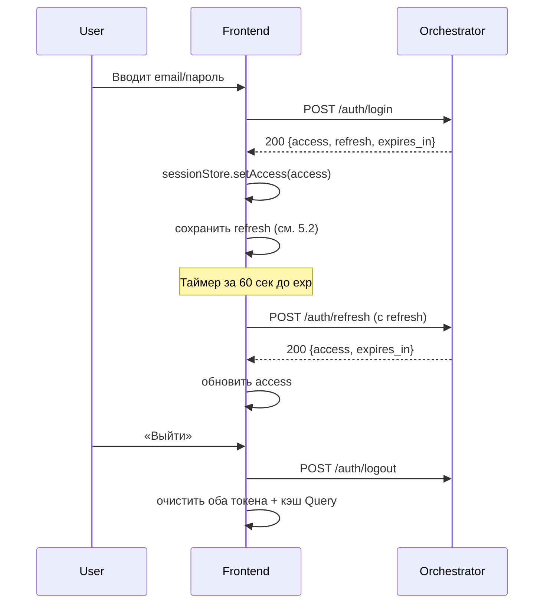
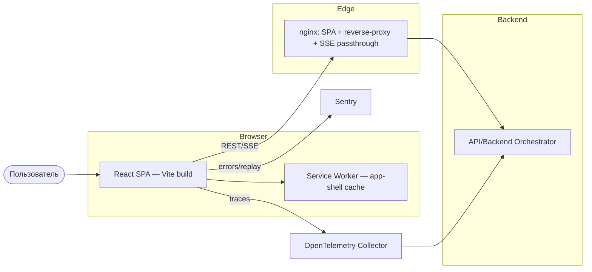
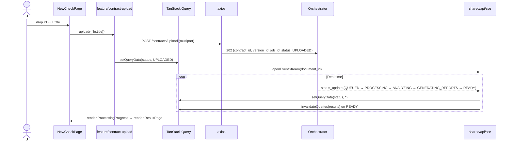
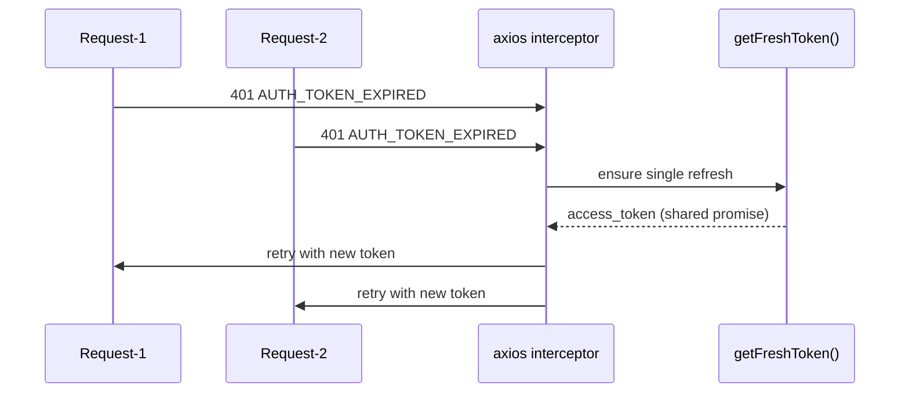
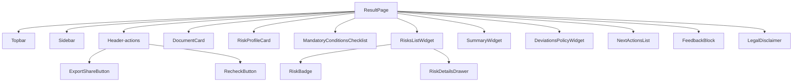

# Архитектура Frontend-сервиса ContractPro

> Единый архитектурный документ Frontend-сервиса ContractPro. Проектирование выполнено на основании трёх источников истины: Figma-макета (10 экранов, 80+ состояний), спецификации API/Backend Orchestrator (`ApiBackendOrchestrator/architecture/api-specification.yaml` + 10 документов архитектуры) и требований (`docs/ТЗ-1. Модуль проверки договора.md`, `docs/domain-decomposition.md`).

Соглашения:
- Любое решение сопровождается обоснованием «почему X, а не Y».
- В каждом разделе явно проставлены ссылки на подтверждающий источник: **[Figma]**, **[API]**, **[ТЗ]**.
- Все пользовательские сообщения — на русском языке (NFR-5.2). Код и идентификаторы — на английском.

---

## 0. Резюме (TL;DR)

| Аспект | Решение |
|---|---|
| Язык / рантайм | TypeScript 5.4+ (strict), React 18.3, Node 20 LTS |
| Архитектурный паттерн | **Feature-Sliced Design v2** (layers: `app/processes/pages/widgets/features/entities/shared`) |
| Сборка | **Vite 5** + SWC |
| Роутинг | **React Router 6.22** (data routers + loaders) |
| Серверный стейт | **TanStack Query v5** + кастомный SSE-синхронизатор кэша |
| Клиентский стейт | **Zustand 4** (auth, ui-preferences, modal/toast) |
| Формы | **React Hook Form 7** + **Zod 3** |
| UI / дизайн-система | **Radix UI Primitives** + **Tailwind CSS 3.4** + shadcn/ui как основа (оранжевый токен `#F55E12`) |
| i18n | **i18next** + `react-i18next` (ресурсы `ru`, подготовка `en`) |
| HTTP | **axios 1.7** с интерцепторами (auth, retry, correlation-id, rate-limit) |
| Real-time | **Нативный EventSource** + собственный reconnect/heartbeat-watchdog, fallback на poll-queue |
| Тестирование | **Vitest** (unit), **Testing Library** (компоненты), **Playwright** (e2e), **MSW** (API-моки), **Storybook 8** + Chromatic (visual regression) |
| Типы из OpenAPI | **openapi-typescript** — генерация `shared/api/openapi.d.ts` |
| Observability | **Sentry SDK** + **OpenTelemetry JS (web)** OTLP/HTTP → Orchestrator-collector |
| CI/CD | GitHub Actions → Docker multi-stage (node:20 → nginx:1.27-alpine) |

Ключевые ADR (см. §16):
- **ADR-FE-01**: Feature-Sliced Design как доменно-ориентированный каркас, соответствующий 8-доменной backend-модели.
- **ADR-FE-02**: TanStack Query для серверного стейта + SSE как источник внешних инвалидаций.
- **ADR-FE-03**: Access Token в памяти (Zustand), Refresh Token в `Secure; SameSite=Strict` httpOnly-cookie — запрашивается у backend как улучшение текущего контракта (fallback: `sessionStorage`, документирован как известная уязвимость до миграции).
- **ADR-FE-04**: Radix + Tailwind + shadcn, а не MUI/Ant — предсказуемое соответствие Figma-токенам, минимальный bundle.
- **ADR-FE-05**: OpenAPI как единственный источник типов API; ручные типы запрещены.

---

## 1. Общая архитектурная философия

### 1.1 Выбор паттерна: Feature-Sliced Design

**Альтернативы:**
- «Плоский» layout (`components/`, `pages/`, `hooks/`) — масштабируется плохо при 10 экранах × 80+ состояниях.
- Чистый Domain-Driven + Hexagonal — переизбыточен для SPA без сложной бизнес-логики на клиенте; добавляет слои без пользы.
- Nx monorepo + libs — избыточен для одного артефакта (одно SPA).

**Выбор: Feature-Sliced Design v2** — де-факто индустриальный стандарт для корпоративных SPA и русскоязычных команд. Его слои (Entities / Features / Widgets / Pages) изоморфны доменной декомпозиции бэкенда (`Contracts`, `Versions`, `Risks`, `Comparison`, `Reports`, `Audit`, `Policies`). Это позволяет:
- Выдерживать одностороннюю зависимость слоёв (верхний → нижний), что исключает циклы.
- Ограничивать радиус изменений — бизнес-фичу можно добавить/удалить локально.
- Явно маркировать shared-слой: дизайн-система живёт в `shared/ui`, API — в `shared/api`.

### 1.2 Принципы организации кода

1. **Слоёная изоляция.** `features/*` не импортирует другие `features/*`; переиспользование идёт через `entities/*` и `shared/*`.
2. **Public API на каждом слайсе.** Единая точка входа через `index.ts` — остальное приватно.
3. **Явная граница домена vs. UI.** `entities/contract/model` (типы + query-ключи + нормализация) отделён от `entities/contract/ui` (RiskBadge, StatusPill).
4. **Правило «один экран — одна страница».** Page-компонент оркеструет widgets; сам не знает про API.
5. **Запрет прокидывания props глубже 2 уровней** — выше поднимается в widget или в стор.

### 1.3 Стратегия масштабирования

- Новая фича создаётся как новый слайс `features/<name>` — без правок уже существующих.
- Отказ от «God-хуков». Один хук отвечает за одну серверную операцию или одну UI-политику.
- На >50 фич — миграция в Nx-monorepo с сохранением FSD как внутреннего соглашения libs.

---

## 2. Структура проекта

```
Frontend/
├── public/                             # статика (favicons, robots.txt)
├── src/
│   ├── app/                            # композиция приложения
│   │   ├── providers/                  # QueryClientProvider, RouterProvider, I18nProvider, ErrorBoundary, ThemeProvider
│   │   ├── router/                     # createBrowserRouter + routeTree
│   │   ├── styles/                     # tailwind.css, reset, tokens.css
│   │   └── App.tsx                     # entry
│   │
│   ├── processes/                      # многошаговые бизнес-процессы
│   │   ├── auth-flow/                  # login → refresh → logout → session-watchdog
│   │   └── upload-and-analyze/         # upload → poll/SSE → [при AWAITING_USER_INPUT: low-confidence-confirm] → result
│   │
│   ├── pages/                          # route-компоненты — один файл на экран Figma
│   │   ├── landing/
│   │   ├── auth/                       # LoginPage (desktop + mobile variant)
│   │   ├── dashboard/
│   │   ├── new-check/                  # "Новая проверка договора"
│   │   ├── contracts-list/             # "Документы и история проверок"
│   │   ├── contract-detail/            # "Карточка документа"
│   │   ├── result/                     # "Результат проверки"
│   │   ├── comparison/                 # "Сравнение версий"
│   │   ├── reports/                    # "Отчёты и Shared Results"
│   │   ├── audit/                      # "Журнал действий и аудит" — v1.1 (нет backend API + storage); v1 — не имплементируется (см. §18 п.5)
│   │   ├── admin-policies/             # v1: placeholder с EmptyState; финал — DESIGN-TASK-002 (см. §18 п.4)
│   │   ├── admin-checklists/           # v1: placeholder с EmptyState; финал — DESIGN-TASK-002 (см. §18 п.4)
│   │   ├── settings/
│   │   └── errors/                     # 403 / 404 / 500 / offline
│   │
│   ├── widgets/                        # сложные композиции, привязанные к секциям макета
│   │   ├── sidebar-navigation/
│   │   ├── topbar/
│   │   ├── risk-profile-card/
│   │   ├── mandatory-conditions-checklist/
│   │   ├── risks-list/
│   │   ├── recommendations-list/
│   │   ├── diff-viewer/
│   │   ├── versions-timeline/
│   │   ├── documents-table/
│   │   ├── audit-table/
│   │   ├── processing-progress/        # 10-шаговый статус-индикатор (включая опциональную паузу AWAITING_USER_INPUT)
│   │   ├── export-share-modal/
│   │   ├── feedback-block/
│   │   └── legal-disclaimer/
│   │
│   ├── features/                       # атомарные пользовательские действия
│   │   ├── auth/
│   │   │   ├── login/
│   │   │   ├── refresh-session/
│   │   │   └── logout/
│   │   ├── contract-upload/            # drag-and-drop + multipart + progress
│   │   ├── contract-archive/
│   │   ├── contract-delete/
│   │   ├── version-upload/
│   │   ├── version-recheck/
│   │   ├── comparison-start/
│   │   ├── low-confidence-confirm/     # блокирующий шаг: реакция на SSE type_confirmation_required + POST /contracts/{id}/versions/{vid}/confirm-type. См. ApiBackendOrchestrator §8.11 / sequence 8.15
│   │   ├── filters/                    # chips, status-filter, risk-filter
│   │   ├── search/
│   │   ├── pagination/
│   │   ├── export-download/            # redirect 302 → presigned URL
│   │   ├── share-link/
│   │   ├── feedback-submit/
│   │   ├── policy-edit/
│   │   └── checklist-edit/
│   │
│   ├── entities/                       # доменные сущности (типы + API-хуки + презентация)
│   │   ├── user/                       # User { user_id, email, name, role, organization_id, organization_name, permissions: { export_enabled } } — тип сгенерирован openapi-typescript из UserProfile + UserPermissions (см. §5.6 + Orchestrator high-architecture §6.21 Permissions Resolver)
│   │   ├── contract/                   # Contract, ContractStatus
│   │   ├── version/                    # Version, VersionStatus = UserProcessingStatus из ApiBackendOrchestrator/architecture/api-specification.yaml (10 значений — публичный фасад Orchestrator, включая AWAITING_USER_INPUT для FR-2.1.3)
│   │   ├── job/                        # Job (упрощённо — для SSE-статуса)
│   │   ├── risk/                       # Risk + уровни, RiskBadge
│   │   ├── recommendation/
│   │   ├── summary/
│   │   ├── diff/                       # text_diffs / structural_diffs
│   │   ├── report/
│   │   ├── policy/
│   │   ├── checklist/
│   │   ├── audit-record/
│   │   └── artifact/                   # 15 типов: 5 DP + 8 LIC + 2 RE. Source of truth — DocumentManagement/architecture/high-architecture.md (enum `artifact_type`); соответствие artifact ↔ UI-компонент ↔ доступная роль — §17.5
│   │
│   └── shared/                         # утилиты, дизайн-система, API
│       ├── api/
│       │   ├── client.ts               # axios + interceptors
│       │   ├── sse.ts                  # EventSource wrapper
│       │   ├── query-keys.ts           # централизованный реестр query-ключей
│       │   ├── openapi.d.ts            # генерируется из api-specification.yaml
│       │   └── errors/                 # ErrorCode, toUserMessage()
│       ├── auth/
│       │   ├── session-store.ts        # Zustand store для access token
│       │   └── rbac.ts                 # permissions + <Can> + useCan()
│       ├── ui/                         # дизайн-система (80+ компонентов)
│       │   ├── button/
│       │   ├── badge/
│       │   ├── table/                  # TanStack Table-based
│       │   ├── file-drop-zone/
│       │   ├── progress/
│       │   ├── modal/
│       │   ├── toast/
│       │   ├── chip/
│       │   ├── pagination/
│       │   ├── search-input/
│       │   ├── breadcrumbs/
│       │   ├── tooltip/
│       │   ├── tabs/
│       │   ├── accordion/
│       │   ├── segmented-control/
│       │   └── ...
│       ├── lib/
│       │   ├── date/                   # date-fns + ru locale
│       │   ├── formatters/             # fileSize, bytes, rubles
│       │   ├── pdf-preview/            # обёртка над pdfjs-dist
│       │   └── hooks/                  # useDebounce, useMediaQuery, useCopy
│       ├── config/
│       │   ├── env.ts                  # runtime-config с валидацией zod
│       │   ├── constants.ts            # MAX_FILE_SIZE=20MB, SSE_HEARTBEAT_MS=15000
│       │   ├── flags.ts                # FEATURE_* флаги (см. §13.4)
│       │   └── file-formats.ts         # FILE_FORMATS table (MIME + magic-bytes + feature-flag), getActiveFormats() — см. §7.5
│       ├── i18n/
│       │   └── locales/ru/*.json
│       └── observability/
│           ├── sentry.ts
│           ├── otel.ts
│           └── logger.ts
│
├── tests/
│   ├── e2e/                            # Playwright
│   ├── fixtures/                       # моки ответов API
│   └── msw/                            # handlers
├── .storybook/
├── Dockerfile
├── nginx.conf
├── vite.config.ts
├── tsconfig.json
├── tailwind.config.ts
├── package.json
└── README.md
```

### 2.1 Правила зависимостей (enforced eslint-plugin-boundaries)

```
app  →  processes  →  pages  →  widgets  →  features  →  entities  →  shared
```

Зависимости вверх — запрещены. Горизонтально между слайсами одного слоя — запрещены.

---

## 3. Стек технологий

| Категория | Выбор | Версия | Альтернативы и обоснование |
|---|---|---|---|
| Фреймворк | React | 18.3 | Next.js отклонён: SSR не требуется, SPA+nginx достаточно; Next добавляет сложность деплоя и split-runtime, неоправданную при закрытом доступе. |
| Язык | TypeScript (`strict`) | 5.4+ | Без обсуждений: enterprise, 10 экранов с богатыми типами API. |
| Сборка | Vite + SWC | 5.2 | Webpack отклонён: медленнее HMR в 5–10×. Rspack ещё не production-stable для плагинов. |
| Роутинг | React Router | 6.22 (data routers) | TanStack Router отклонён: зрелость ниже, экосистема меньше. Data-loaders React Router 6.4+ дают SSR-ready parallel-fetch без SSR. |
| Server state | TanStack Query | 5.x | RTK Query отклонён — навязывает Redux, тяжёлый. SWR — беднее в инвалидациях/мутациях. |
| Client state | Zustand | 4.x | Redux Toolkit отклонён: overkill при малом UI-стейте; Jotai — хуже DevTools. |
| Формы | React Hook Form + Zod | 7 / 3 | Formik отклонён (медленный); валидация Zod переиспользуется на клиенте и (опционально) в e2e-моках. |
| UI примитивы | Radix UI | latest | Headless + доступность AAA. MUI/Ant отклонены: тяжёлые, плохо ложатся на Figma-токены с `#F55E12`. |
| Стили | Tailwind CSS + CSS Variables для токенов | 3.4 | CSS-in-JS (Emotion) отклонён: runtime overhead; Tailwind + tokens.css даёт мгновенное соответствие Figma. |
| Компонентная база | shadcn/ui (форк Radix + Tailwind) | — | Копируется в `shared/ui`, не является зависимостью → полный контроль дизайна. |
| Таблицы | TanStack Table | 8 | Нативно поддерживает серверную пагинацию, сортировку, фильтры — нужны на всех списковых экранах. |
| Diff-viewer | `diff-match-patch` + кастомный рендер | — | `react-diff-viewer` отклонён: не поддерживает структурный diff из SemanticTree. |
| PDF preview | `pdfjs-dist` (lazy-loaded) | 4.x | Нужен в «Карточке документа» (превью с оглавлением). |
| Drag-and-drop | `react-dropzone` | 14 | Принят стандарт индустрии. |
| HTTP | axios | 1.7 | `fetch` отклонён: нет интерцепторов для retry/auth. |
| SSE | native EventSource + кастомный wrapper | — | `eventsource-polyfill` только для прохождения `?token=` на IE/Safari-edge, но в поддержке v1 нет — не включается. |
| i18n | i18next + react-i18next | 23 / 14 | FormatJS/react-intl отклонён: тяжелее, формат ICU избыточен для ru. |
| Тестирование (unit) | Vitest + Testing Library | 1.6 / 14 | Jest отклонён: совместимость с Vite хуже. |
| Тестирование (API моки) | MSW | 2.x | Service Worker — единый мокинг для dev, test, Storybook. |
| Тестирование (e2e) | Playwright | 1.44 | Cypress отклонён: worse parallelism, hybrid-trace инструментов. |
| Визуальная регрессия | Chromatic + Storybook | — | Покрывает 80+ состояний UI. |
| Линт / формат | ESLint (typescript-eslint) + Prettier + eslint-plugin-boundaries | 9 / 3 | — |
| Хуки Git | Husky + lint-staged + commitlint | — | — |
| Observability | Sentry + OpenTelemetry Web SDK | — | Sentry — ошибки и perf; OTEL — распределённые трейсы до Orchestrator. |
| Type-generation | openapi-typescript + openapi-fetch | 6 / 0.9 | Прямо из `ApiBackendOrchestrator/architecture/api-specification.yaml`. |

---

## 4. Управление состоянием

### 4.1 Разделение ответственности

| Тип стейта | Инструмент | Примеры |
|---|---|---|
| Серверный (read) | TanStack Query | Список договоров, детали версии, результаты, audit-лог |
| Серверный (write) | TanStack Query Mutations | Загрузка, архивация, recheck, feedback |
| Реал-тайм | TanStack Query `setQueryData` из SSE | Обновление статуса версии в кэше без повторного GET |
| Сессия | Zustand | access_token, user, role, organization_id |
| UI | Zustand slices + локальный `useState` | Модалки, drawer, sidebar collapsed, выбранные фильтры |
| Формы | React Hook Form | Формы логина, фидбэка, upload-title, admin-policies |
| URL-стейт | `useSearchParams` | Пагинация, фильтры (для shareable ссылок) |

### 4.2 Реестр query-ключей (`shared/api/query-keys.ts`)

Централизован, иерархичен — чтобы инвалидация одним `queryClient.invalidateQueries({ queryKey: qk.contracts.all })` чистила всё связанное.

```ts
export const qk = {
  me: ['me'] as const,
  contracts: {
    all: ['contracts'] as const,
    list: (p: ListParams) => ['contracts', 'list', p] as const,
    byId: (id: string) => ['contracts', id] as const,
    versions: (id: string) => ['contracts', id, 'versions'] as const,
    version: (id: string, vid: string) => ['contracts', id, 'versions', vid] as const,
    status: (id: string, vid: string) => ['contracts', id, 'versions', vid, 'status'] as const,
    results: (id: string, vid: string) => ['contracts', id, 'versions', vid, 'results'] as const,
    risks: (id: string, vid: string) => ['contracts', id, 'versions', vid, 'risks'] as const,
    summary: (id: string, vid: string) => ['contracts', id, 'versions', vid, 'summary'] as const,
    recommendations: (id: string, vid: string) => ['contracts', id, 'versions', vid, 'recommendations'] as const,
    diff: (id: string, b: string, t: string) => ['contracts', id, 'diff', b, t] as const,
  },
  admin: {
    policies: ['admin', 'policies'] as const,
    checklists: ['admin', 'checklists'] as const,
  },
  audit: (f: AuditFilters) => ['audit', f] as const,
} as const;
```

### 4.3 Стратегия кэширования

- `staleTime` по умолчанию — **30 сек** (совпадает с частотой пересчёта дашборда).
- Статусы обработки (`version.status`) — `staleTime: 0`, источник истины — SSE.
- Результаты после `READY` — `staleTime: Infinity`, инвалидация только при `recheck`.
- Audit-лог — `staleTime: 15 сек`, `refetchOnWindowFocus: true`.

### 4.4 Интеграция SSE в кэш

`useEventStream` подписывается на `/events/stream?token=<jwt>&document_id=<id>` и на каждое `status_update` вызывает `queryClient.setQueryData(qk.contracts.status(id, vid), patch)` + при `status === 'READY'` — `invalidateQueries(qk.contracts.results(...))`.

### 4.5 Оптимистичные обновления

Применяются ограниченно — только там, где откат безопасен и UX-выигрыш очевиден:
- Archive/Delete/Star контракта.
- Отметка риска «просмотрено» (локально).
- Submit feedback.

Не применяются к upload / recheck / comparison — операции асинхронные, пользователь должен увидеть реальный `202 Accepted` + статусы SSE.

### 4.6 Система тостов и real-time уведомлений

Zustand store `toastStore` с API `toast.success | error | warn | info | sticky`. SSE-события `FAILED`, `PARTIALLY_FAILED`, `REJECTED` → sticky-toast с кнопкой «Повторить», `READY` → success-toast со ссылкой на «Результат».

---

## 5. Аутентификация и авторизация

### 5.1 Flow (соответствует sequence-diagrams.md)



### 5.2 Хранение токенов (ADR-FE-03)

| Токен | Где хранится | Почему |
|---|---|---|
| **Access (15 мин)** | Память (Zustand, не сериализуется) | Минимизация XSS-радиуса. Перезагрузка → silent-refresh по refresh-токену. |
| **Refresh (30 дней)** — целевой режим | `HttpOnly; Secure; SameSite=Strict` cookie (выставляется Orchestrator) | Недоступен JS → XSS не сливает refresh. Требует изменения контракта backend (см. §15, открытый вопрос). |
| **Refresh — fallback на v1** | `sessionStorage` с обфускацией | Переживает только вкладку. `localStorage` отклонён — пересекает вкладки, бОльшая поверхность атаки. |

Открытый вопрос для backend-команды: добавить опциональный режим `Set-Cookie: refresh_token=...; HttpOnly` в `/auth/login` и чтение cookie в `/auth/refresh` (текущая спецификация требует JSON-body).

### 5.3 Автоматический refresh

- Таймер срабатывает за 60 секунд до `exp` (безопасный буфер при 15-мин access).
- На 401 с `AUTH_TOKEN_EXPIRED` — интерцептор блокирует все последующие запросы, ставит их в очередь, запускает один refresh, при успехе — переигрывает очередь; при провале — logout + редирект на `/login?redirect=<current>`.

### 5.4 Гонки при одновременных запросах

Паттерн «**shared promise**» в axios-интерцепторе:
```ts
let refreshing: Promise<string> | null = null;
function getFreshToken() {
  if (!refreshing) refreshing = doRefresh().finally(() => { refreshing = null; });
  return refreshing;
}
```
Гарантирует единственный запрос `/auth/refresh` даже при 20 параллельных 401.

### 5.5 RBAC на клиенте

Роли: `LAWYER`, `BUSINESS_USER`, `ORG_ADMIN` (3 — и только 3, ТЗ).

```ts
// shared/auth/rbac.ts
export const PERMISSIONS = {
  'contract.upload': ['LAWYER', 'BUSINESS_USER', 'ORG_ADMIN'],
  'contract.archive': ['LAWYER', 'ORG_ADMIN'],
  'risks.view': ['LAWYER', 'ORG_ADMIN'],
  'summary.view': ['LAWYER', 'BUSINESS_USER', 'ORG_ADMIN'],
  'recommendations.view': ['LAWYER', 'ORG_ADMIN'],
  'comparison.run': ['LAWYER', 'ORG_ADMIN'],
  'version.recheck': ['LAWYER', 'ORG_ADMIN'],
  'admin.policies': ['ORG_ADMIN'],
  'admin.checklists': ['ORG_ADMIN'],
  'audit.view': ['ORG_ADMIN'],
  // export.download: BUSINESS_USER условно разрешён, проверка через useCanExport() (см. §5.6 + Orchestrator high-architecture §6.21 Permissions Resolver).
  // В этой таблице — только безусловный role-based whitelist.
  'export.download': ['LAWYER', 'ORG_ADMIN'],
} as const;

export function useCan(permission: keyof typeof PERMISSIONS): boolean { ... }
export function Can({ I, children, fallback }): JSX.Element { ... }
```

### 5.6 Условный рендеринг и guards

- **Route guard**: `<RequireRole roles={['ORG_ADMIN']}>` для `/admin/*`, `/audit/*` (последний — заготовка под v1.1, в v1 маршрут не активен; см. §18 п.5).
- **Компонентный guard**: `<Can I="risks.view">` — показывает «Полные риски» только LAWYER/ORG_ADMIN; BUSINESS_USER видит только summary (R-2 из ТЗ).
- **Условные разрешения (role + policy)**: некоторые действия требуют комбинации «роль + computed-флаг от backend». Реализуются специализированным хуком, не таблицей `PERMISSIONS`. Пример — экспорт для BUSINESS_USER (UR-10, ТЗ «по политике организации», computed-логика — Orchestrator high-architecture §6.21):
  ```ts
  // shared/auth/use-can-export.ts
  export function useCanExport(): boolean {
    const role = useSession((s) => s.user?.role);
    const exportEnabled = useSession((s) => s.user?.permissions?.export_enabled);
    if (role === 'LAWYER' || role === 'ORG_ADMIN') return true;
    if (role === 'BUSINESS_USER') return exportEnabled === true; // default false на стороне backend (env ORCH_OPM_FALLBACK_BUSINESS_USER_EXPORT)
    return false;
  }
  ```
  Источник `permissions.export_enabled` — computed-флаг в `GET /users/me` от Orchestrator (контракт: `UserPermissions` schema в `api-specification.yaml` + Orchestrator high-architecture §6.21 Permissions Resolver). Frontend **не дёргает OPM напрямую** и не интерпретирует политику — только потребляет уже вычисленный boolean.
- **Server-truth**: RBAC на клиенте — только UX-защита. Backend остаётся истиной. На `403 PERMISSION_DENIED` показываем экран «Недостаточно прав».

#### 5.6.1 Маппинг Figma role-restricted states ↔ frontend-паттерны

В Figma присутствуют **4 явных state-фрейма** про role-restriction на разных экранах. Названия в Figma расходятся («Limited Access» / «Access Restricted» / «Role-Restricted») — фактически описывают два разных паттерна.

**Два паттерна ограничения доступа:**
- **Pattern A — Full route block.** Пользователь не доходит до экрана: `<RequireRole>` redirect → `/403` (отдельный маршрут с `<EmptyState>` «Недостаточно прав. Обратитесь к администратору»). Рендерится для маршрутов, целиком закрытых для роли (`/admin/*`, `/audit` в v1.1).
- **Pattern B — Section hiding.** Пользователь заходит на экран, но отдельные секции/виджеты/действия скрыты `<Can>`-guard'ом. Используется на экранах со смешанным доступом (BUSINESS_USER видит summary, но не риски на ResultPage / ContractDetail).

**Таблица соответствия:**

| # | Figma-экран | State name (Figma) | Frame ID | Паттерн | Frontend-реализация |
|---|---|---|---|---|---|
| 1 | 7. Документы | «Limited Access Role Restriction» | `215:2` | **B** | `<Can I="contract.archive">` оборачивает toolbar-кнопки (Archive, Delete); column visibility в `DocumentsTable` фильтруется по `useCan()` (для BUSINESS_USER скрыта колонка «Действия») |
| 2 | 9. Отчёты | «Access Restricted» | `235:12` | **A** или **B** (TBD: уточнить с дизайном) | Если **A**: `<RequireRole roles={['LAWYER','ORG_ADMIN']}>` для `/reports` → redirect `/403`. Если **B**: `<Can I="risks.view">` оборачивает основной контент, fallback — inline `<EmptyState>` «Доступно только юристам» |
| 3 | 10. Аудит | «Limited Access» | `256:43` | **A** | В v1 не реализуется (см. §18 п.5 — `/audit` отложен в v1.1). При активации — `<RequireRole roles={['ORG_ADMIN']}>` → `/403` для не-админов |
| 4 | 8. Карточка документа | «Role-Restricted» | `322:3` | **B** | `<Can I="risks.view">` оборачивает `RiskProfileCard` + `RisksList`; `<Can I="recommendations.view">` оборачивает `RecommendationsList`. BUSINESS_USER видит DocumentHeader + Summary + KeyParameters, остальные секции скрыты |

**Что нужно уточнить с дизайн-командой:**
1. **Reports state `235:12`** — это полноэкранный 403-fallback (Pattern A) или inline `EmptyState` внутри страницы (Pattern B)? Сейчас RBAC-матрица (`security.md` §2.2) даёт BUSINESS_USER только `/contracts`, `/contracts/{id}`, summary; reports недоступен — значит, скорее **A**. Подтвердить.
2. **Документы state `215:2`** — какие именно колонки/действия скрыты для BUSINESS_USER? Нужен явный список из макета.
3. **Document Card state `322:3`** — порядок секций сохраняется (с пробелами вместо скрытых) или секции collapse'ятся (визуально без пробелов)? Влияет на CSS-стратегию.

**Принципы реализации:**
- Все role-restricted состояния тестируются как отдельные Storybook stories (`*.role-restricted.stories.tsx`) — покрываются Chromatic visual regression.
- Pattern A — единственный fallback `/403` page; не дублировать содержимое каждого экрана.
- Pattern B — `<Can>` всегда возвращает `null` или `fallback`-prop, никогда `<div style={{display:'none'}}>` (нагрузка на DOM + утечка через DevTools).
- Скрытые элементы **не должны** загружать соответствующие данные — query-хук вызывается только если `useCan(...) === true`.

### 5.7 Edge-cases

| Ситуация | Поведение |
|---|---|
| Одновременный refresh | Shared-promise (см. 5.4) |
| Refresh отозван во время активной сессии | logout + редирект + sticky-toast «Сессия завершена» |
| Tab Sleep → expired | На resume — silent refresh; SSE переподключается (см. §7) |
| Вкладка открыта, roles изменились | `GET /users/me` при фокусе окна; если role ≠ текущей — soft-logout |

---

## 6. Маршрутизация

### 6.1 Карта маршрутов

| Путь | Компонент | Guard | Экран Figma |
|---|---|---|---|
| `/` | `LandingPage` | public | 1. Landing Page |
| `/login` | `LoginPage` | public | 2. Auth Page |
| `/dashboard` | `DashboardPage` | auth | 3. Dashboard |
| `/contracts` | `ContractsListPage` | auth | 7. Документы |
| `/contracts/new` | `NewCheckPage` | auth + `contract.upload` | 4. Новая проверка |
| `/contracts/:id` | `ContractDetailPage` | auth | 8. Карточка документа |
| `/contracts/:id/versions/:vid/result` | `ResultPage` | auth | 5. Результат |
| `/contracts/:id/compare?base=&target=` | `ComparisonPage` | auth + `comparison.run` | 6. Сравнение версий |
| `/reports` | `ReportsPage` | auth | 9. Отчёты |
| `/audit` | `AuditPage` | auth + `audit.view` | 10. Журнал |
| `/admin/policies` | `AdminPoliciesPage` | auth + `admin.policies` | — (UI для PUT /admin/policies) |
| `/admin/checklists` | `AdminChecklistsPage` | auth + `admin.checklists` | — |
| `/settings` | `SettingsPage` | auth | Sidebar → Настройки |
| `/403`, `/404`, `/500`, `/offline` | Error pages | — | — |

### 6.2 Data-loaders (React Router 6.4+)

`pages/contract-detail/route.tsx`:
```ts
export const contractDetailRoute = {
  path: '/contracts/:id',
  loader: ({ params }) => Promise.all([
    queryClient.ensureQueryData({ queryKey: qk.contracts.byId(params.id!), queryFn: ... }),
    queryClient.ensureQueryData({ queryKey: qk.contracts.versions(params.id!), queryFn: ... }),
  ]),
  element: <ContractDetailPage />,
  errorElement: <RouteErrorBoundary />,
};
```

Паттерн «render-as-you-fetch» — параллельные запросы стартуют до монтирования компонента.

### 6.3 Code-splitting

Каждая `page/*` — отдельный `React.lazy`. Granular-чанки:
- `chunks/diff-viewer` (diff-match-patch, ~60 КБ) — только для `/compare`.
- `chunks/pdf-preview` (pdfjs-dist, ~500 КБ) — только для `/contracts/:id`.
- `chunks/admin` — только для ORG_ADMIN. В v1 содержит только `EmptyState` (~5 КБ); полноценные формы — v1.0.1 после `DESIGN-TASK-002` / `FE-TASK-002`.

### 6.4 Breadcrumbs

Генерируются из `matches` React Router через `useMatches()`. Каждый route-object включает `handle: { crumb: (data) => 'Главная' | ... }`.

---

## 7. Интеграция с API

### 7.1 Слои

```
UI  →  feature-hook  →  service (в features/*/api)  →  openapi-fetch  →  axios-инстанс  →  Orchestrator
                                                                    ↑
                                                               interceptors:
                                                               1. inject Authorization
                                                               2. inject X-Correlation-Id
                                                               3. normalize ErrorResponse
                                                               4. handle 401 → refresh
                                                               5. handle 429 → retry with Retry-After
                                                               6. handle 302 → download
```

### 7.2 HTTP-клиент

`baseURL` всегда **относительный** (`/api/v1`) — same-origin deployment (см. §13.2 + ADR-6 в backend). В production nginx-proxy перенаправляет на Orchestrator, в dev — Vite-proxy (`vite.config.ts → server.proxy: {'/api': 'http://localhost:8080'}`). Браузер видит один origin → CORS не активируется → `traceparent` от OpenTelemetry (§14.3) не требует preflight allow-list.

```ts
// shared/api/client.ts
export const http = axios.create({
  baseURL: env.API_BASE_URL, // относительный путь '/api/v1' — same-origin (см. §13.2 + ADR-6)
  timeout: 30_000,
});

http.interceptors.request.use((cfg) => {
  const token = sessionStore.getState().accessToken;
  if (token) cfg.headers.Authorization = `Bearer ${token}`;
  cfg.headers['X-Correlation-Id'] = cfg.headers['X-Correlation-Id'] ?? crypto.randomUUID();
  return cfg;
});

http.interceptors.response.use(identity, async (err: AxiosError<ErrorResponse>) => {
  const status = err.response?.status;
  const body = err.response?.data;

  // 1. 401 → silent refresh + replay
  if (status === 401 && body?.error_code === 'AUTH_TOKEN_EXPIRED') {
    await getFreshToken();
    return http.request(err.config!);
  }
  // 2. 429 → ждать Retry-After, повторить 1 раз
  if (status === 429) {
    const retryAfter = Number(err.response?.headers['retry-after'] ?? 5);
    await sleep(retryAfter * 1000);
    return http.request(err.config!);
  }
  // 3. Нормализация доменной ошибки
  throw new OrchestratorError(body, err);
});
```

### 7.3 Централизованный каталог ошибок и UI-сообщений

```ts
// shared/api/errors/catalog.ts
export const ERROR_UX: Record<ErrorCode, { title: string; hint?: string; action?: 'retry' | 'login' | 'none' }> = {
  AUTH_TOKEN_MISSING:      { title: 'Требуется вход в систему',                  action: 'login' },
  AUTH_TOKEN_EXPIRED:      { title: 'Сессия истекла. Войдите заново.',           action: 'login' },
  AUTH_TOKEN_INVALID:      { title: 'Невалидная авторизация. Войдите заново.',   action: 'login' },
  PERMISSION_DENIED:       { title: 'У вас нет прав на это действие',             action: 'none' },
  FILE_TOO_LARGE:          { title: 'Файл больше 20 МБ', hint: 'Сократите объём или разделите документ.' },
  UNSUPPORTED_FORMAT:      { title: 'Поддерживается только PDF', hint: 'Сохраните документ в PDF и повторите.' },
  INVALID_FILE:            { title: 'Файл повреждён или не читается' },
  DOCUMENT_NOT_FOUND:      { title: 'Документ не найден' },
  VERSION_NOT_FOUND:       { title: 'Версия не найдена' },
  ARTIFACT_NOT_FOUND:      { title: 'Результат пока недоступен. Повторите позже.' },
  DIFF_NOT_FOUND:          { title: 'Сравнение ещё не готово' },
  DOCUMENT_ARCHIVED:       { title: 'Документ в архиве. Действие недоступно.' },
  DOCUMENT_DELETED:        { title: 'Документ удалён' },
  VERSION_STILL_PROCESSING:{ title: 'Версия ещё обрабатывается', hint: 'Дождитесь завершения.' },
  RESULTS_NOT_READY:       { title: 'Результаты ещё не готовы' },
  RATE_LIMIT_EXCEEDED:     { title: 'Слишком много запросов', hint: 'Повторите через несколько секунд.', action: 'retry' },
  STORAGE_UNAVAILABLE:     { title: 'Хранилище временно недоступно',     action: 'retry' },
  DM_UNAVAILABLE:          { title: 'Сервис временно недоступен',        action: 'retry' },
  OPM_UNAVAILABLE:         { title: 'Сервис политик временно недоступен', action: 'retry' },
  BROKER_UNAVAILABLE:      { title: 'Обработка временно недоступна',     action: 'retry' },
  VALIDATION_ERROR:        { title: 'Проверьте введённые данные' },
  INTERNAL_ERROR:          { title: 'Произошла ошибка. Мы уже знаем.',   action: 'retry' },
};
```

Важно: **к финальному UI предпочтительно прокидывать `message` из тела ответа** (он уже на русском — контракт backend), а `ERROR_UX` использовать как fallback и как источник `action`.

### 7.4 Retry-политика

| Ситуация | Политика |
|---|---|
| 429 | Экспонента базируется на `Retry-After`. Одна попытка. |
| 502/503 | 3 попытки с exponential backoff (1с/2с/4с) только для идемпотентных GET. |
| 500 | Без авторетрая. Пользователь видит toast с `correlation_id` и кнопкой «Повторить». |
| Network error | 1 retry через 1с; при повторе — показать `/offline` баннер. |

### 7.5 Загрузка файлов

```ts
// features/contract-upload/api/upload.ts
export async function uploadContract(file: File, title: string, onProgress: (p: number) => void) {
  const fd = new FormData();
  fd.append('file', file);
  fd.append('title', title);
  const { data } = await http.post<UploadResponse>('/contracts/upload', fd, {
    onUploadProgress: (e) => onProgress(e.loaded / e.total!),
    timeout: 120_000, // файл до 20МБ при медленном канале
  });
  return data;
}
```

**Валидация до отправки** — table-driven через `shared/config/file-formats.ts`, чтобы избежать хардкода `application/pdf` при включении `FEATURE_DOCX_UPLOAD` (см. §13.4):

```ts
// shared/config/file-formats.ts
export type FileFormat = {
  id: 'pdf' | 'docx' | 'doc';
  mime: string;
  extensions: string[];     // для accept-атрибута и сообщений
  magicBytes: number[][];   // массив сигнатур; матчится любая (file-type variations)
  label: string;            // для UI: "PDF", "DOCX"
  featureFlag?: 'FEATURE_DOCX_UPLOAD'; // если undefined — формат всегда активен
};

export const FILE_FORMATS: readonly FileFormat[] = [
  {
    id: 'pdf',
    mime: 'application/pdf',
    extensions: ['.pdf'],
    magicBytes: [[0x25, 0x50, 0x44, 0x46]],                   // %PDF
    label: 'PDF',
  },
  {
    id: 'docx',
    mime: 'application/vnd.openxmlformats-officedocument.wordprocessingml.document',
    extensions: ['.docx'],
    magicBytes: [[0x50, 0x4B, 0x03, 0x04], [0x50, 0x4B, 0x05, 0x06]], // PK\x03\x04 / PK\x05\x06 (ZIP)
    label: 'DOCX',
    featureFlag: 'FEATURE_DOCX_UPLOAD',
  },
  {
    id: 'doc',
    mime: 'application/msword',
    extensions: ['.doc'],
    magicBytes: [[0xD0, 0xCF, 0x11, 0xE0, 0xA1, 0xB1, 0x1A, 0xE1]], // OLE Compound Document
    label: 'DOC',
    featureFlag: 'FEATURE_DOCX_UPLOAD',
  },
];

export function getActiveFormats(flags = window.__ENV__.FEATURES): FileFormat[] {
  return FILE_FORMATS.filter((f) => !f.featureFlag || flags[f.featureFlag] === true);
}
```

Валидатор использует таблицу:
```ts
// features/contract-upload/lib/validate-file.ts
export async function validateFile(file: File): Promise<void> {
  if (file.size > MAX_FILE_SIZE) throw new ValidationError('FILE_TOO_LARGE');
  const formats = getActiveFormats();
  const byMime = formats.find((f) => f.mime === file.type);
  if (!byMime) throw new ValidationError('UNSUPPORTED_FORMAT', { allowed: formats.map((f) => f.label) });
  const head = new Uint8Array(await file.slice(0, 16).arrayBuffer());
  const matched = byMime.magicBytes.some((sig) => sig.every((b, i) => head[i] === b));
  if (!matched) throw new ValidationError('INVALID_FILE'); // несоответствие magic-bytes — подмена расширения
}
```

Гарантии:
- **Single source of truth** на frontend: добавить новый формат = одна строка в `FILE_FORMATS`. Хардкода `'application/pdf'` нигде кроме таблицы.
- **Feature flag-driven**: при `FEATURE_DOCX_UPLOAD: false` (v1, см. §13.4) DOC/DOCX отфильтрованы из `getActiveFormats()` — UI не показывает их в `accept`-атрибуте FileDropZone, валидатор отвергает.
- **Синхронизация с backend**: список MIME должен совпадать с `ORCH_UPLOAD_ALLOWED_MIME_TYPES` (default `application/pdf` в `security.md` §6 и `configuration.md`). При расхождении — frontend отвергает раньше, backend всё равно перепроверит. См. §18 п.6 о возможном переходе на динамическую конфигурацию через `GET /config`.

### 7.6 Экспорт (302 Redirect)

`GET /.../export/{pdf|docx}` возвращает 302 с `Location: <presigned URL>` (TTL 5 мин). Браузер сам следует редиректу — для программного скачивания используем `window.location.assign(finalUrl)` или `<a href target="_blank">`. Если axios получает 302 и `followRedirects` отключён — читаем `Location` и делаем `window.open`.

### 7.7 SSE

```ts
// shared/api/sse.ts
export function openEventStream(opts: { documentId?: string; onEvent: (e: StatusEvent) => void }) {
  const token = sessionStore.getState().accessToken!;
  const url = new URL('/api/v1/events/stream', window.location.origin);
  // SECURITY: JWT передаётся в query-параметре, поскольку EventSource API
  // не поддерживает кастомные заголовки. Backend исключает `token` из
  // application и proxy access-логов (security.md §1.7), но JWT всё равно
  // может утечь через browser history, third-party JS (Sentry/GA/расширения),
  // CDN raw access logs, screenshots/shared screen.
  // План миграции: ADR-FE-10 (sse_ticket) — одноразовый short-lived ticket
  // взамен полного JWT. Зависит от backend-эндпоинта POST /auth/sse-ticket
  // (ORCH-TASK-047 в backlog-tasks.json).
  url.searchParams.set('token', token);
  if (opts.documentId) url.searchParams.set('document_id', opts.documentId);

  let es: EventSource | null = null;
  let retry = 0;
  let heartbeatTimer: number | null = null;

  const connect = () => {
    es = new EventSource(url);
    es.addEventListener('status_update', (msg) => {
      opts.onEvent(JSON.parse((msg as MessageEvent).data));
      resetHeartbeat();
    });
    es.onopen = () => { retry = 0; resetHeartbeat(); };
    es.onerror = () => { es?.close(); scheduleReconnect(); };
  };

  const resetHeartbeat = () => {
    if (heartbeatTimer) clearTimeout(heartbeatTimer);
    // backend пингует каждые 15с → даём запас 45с
    heartbeatTimer = window.setTimeout(() => es?.close() ?? scheduleReconnect(), 45_000);
  };

  const scheduleReconnect = () => {
    retry += 1;
    if (retry > 5) { startPollingFallback(); return; }
    setTimeout(connect, Math.min(30_000, 2 ** retry * 1000));
  };

  connect();
  return () => { es?.close(); if (heartbeatTimer) clearTimeout(heartbeatTimer); };
}
```

**Fallback на polling**: если 5 реконнектов подряд упали — переключаемся на `GET /.../status` с интервалом 3 с (середина диапазона 2–5 из ТЗ). Возвращаемся к SSE при успешном open.

**24-часовой max-age** — раз в 24ч принудительно переподключаемся (мягкий reset).

### 7.8 Correlation-Id propagation

Генерируем UUID v4 на фронте, передаём в каждом запросе через `X-Correlation-Id`, логируем в Sentry/OTEL как tag, показываем в UI для 5xx («Скопировать ID ошибки»). Backend уважает наш ID (если есть), иначе использует свой.

---

## 8. Компонентная архитектура

### 8.1 Иерархия

Вместо классического Atomic Design мы используем FSD-native иерархию, которая изоморфна макету:

```
Page (route)                             — например, ResultPage
  ├── Widget (секция макета)              — RiskProfileCard, RisksListWidget
  │     ├── Feature (действие)            — FeedbackSubmitForm, ShareLinkButton
  │     │     ├── Entity UI (inline)      — RiskBadge, StatusBadge
  │     │     └── Shared UI (примитивы)   — Button, Modal, Toast
  │     └── Entity UI
  └── Shared UI
```

### 8.2 Дизайн-система: токены из Figma

```css
/* shared/styles/tokens.css
 * Source of truth: Figma file Lxhk7jQyXL3iuoTpiOHxcb (без Variables — hex'и сняты вручную).
 * Любое изменение — синхронно с Figma. См. ADR-FE-09 (token pipeline).
 */
:root {
  --color-brand-500: #F55E12;  /* primary CTA */
  --color-brand-600: #D14D0D;  /* hover/active */
  --color-brand-50:  #FFF3EB;  /* light tint (производный) */
  --color-fg:        #11111C;  /* ink */
  --color-fg-muted:  #666B78;
  --color-bg:        #FFFFFF;
  --color-bg-muted:  #F9FAFB;
  --color-border:    #D9DEE5;
  --color-success:   #21966B;
  --color-warning:   #FAD133;
  --color-danger:    #DB2626;
  --color-risk-high:    #DB2626;
  --color-risk-medium:  #FAD133;
  --color-risk-low:     #21966B;

  --font-sans: 'Inter', 'PT Root UI', system-ui, sans-serif;
  --radius-sm: 6px;
  --radius-md: 10px;
  --radius-lg: 14px;
  --shadow-sm: 0 1px 2px rgba(15,17,21,.06);
  --shadow-md: 0 4px 12px rgba(15,17,21,.08);

  --space-1: 4px; --space-2: 8px; --space-3: 12px; --space-4: 16px;
  --space-5: 20px; --space-6: 24px; --space-8: 32px; --space-10: 40px; --space-12: 48px;
}
```

Маппится в `tailwind.config.ts` (source: Figma file `Lxhk7jQyXL3iuoTpiOHxcb`):
```ts
// source: Figma fileKey Lxhk7jQyXL3iuoTpiOHxcb — hex'и продублированы из tokens.css
colors: {
  brand: { 50: 'var(--color-brand-50)', 500: 'var(--color-brand-500)', 600: 'var(--color-brand-600)' },
  risk: { high: 'var(--color-risk-high)', medium: 'var(--color-risk-medium)', low: 'var(--color-risk-low)' },
}
```

### 8.3 Ключевые shared-компоненты

| Компонент | Где используется | Ключевые props/состояния |
|---|---|---|
| `DataTable` | Документы, Отчёты, Audit, Версии | сортировка, пагинация, row-selection, empty/loading/error slots, column-visibility |
| `FileDropZone` | NewCheckPage, VersionUpload | drag-hover, selected, error, loading, disabled, max-size guard |
| `ProcessingProgress` | Dashboard, NewCheckPage, ContractDetail | 10 статусов → прогресс-бар + список шагов; для `AWAITING_USER_INPUT` рендерится не как «шаг», а как inline-CTA «Подтвердите тип договора» |
| `RiskBadge` | везде | `level: 'high' \| 'medium' \| 'low'`, tooltip с legend |
| `StatusBadge` | таблицы, карточки | мапит 10 `VersionStatus` в user-строку + цвет |
| `DiffViewer` | ComparisonPage | side-by-side, inline, фильтр по risk/section |
| `FilterChips` | Contracts, Reports, Audit | multi-select + «Ещё фильтры» модалка |
| `Sidebar` | все защищённые страницы | collapsed/expanded, активный пункт, role-sections |
| `Topbar` | все защищённые | поиск (опц.), уведомления, профиль-меню |
| `Modal` (Radix Dialog) | Export/Share, Confirm, Low-confidence confirm | controlled, focus-trap, a11y |
| `Toast` (Radix Toast) | глобально | 4 варианта + sticky |
| `EmptyState` | все списки | заголовок, описание, CTA |
| `LegalDisclaimer` | все экраны результатов | фиксированный текст из ТЗ |

### 8.4 Паттерны

- **Compound components** для `DataTable`: `<DataTable><Toolbar/><Columns/><Rows/><Pagination/></DataTable>`.
- **Headless hooks**: `useContract(id)`, `useVersionStatus(id, vid)`, `useRisks(id, vid)` — возвращают `{data, isLoading, error, refetch}`. UI-компонент рендерит состояния.
- **Slot-pattern** через Radix `Slot` для переиспользуемых триггеров.
- **HOC запрещены** — только hooks + composition.

### 8.5 Состояния компонентов (из Figma)

Каждый интерактивный компонент в Storybook обязан иметь стори для: `Default`, `Hover`, `Active`, `Focus`, `Disabled`, `Loading`, `Error`, `Empty`, `Role-Restricted`. Покрывает требование «80+ состояний UI» (Figma).

### 8.6 Адаптивность

- Breakpoints Tailwind: `sm 640 / md 768 / lg 1024 / xl 1280 / 2xl 1440`.
- **Desktop (1440)** — первичный layout. В Figma имеют десктоп-макет все 10 основных экранов.
- **Tablet (md, 768)** — sidebar свёрнут, таблицы превращаются в карточки. В Figma есть **отдельные tablet-макеты** для 3 экранов: Документы (Reports), Журнал (Audit), Карточка документа (Document Card). Остальные tablet-экраны — responsive-фоллбэк по правилам breakpoint'ов (не выверенный pixel-perfect).
- **Mobile (sm, < 768)** — отдельные макеты только для `/login` (есть Mobile-вариант 390px в Figma) и `/` (Landing). Остальные экраны (Dashboard, Contracts, Result, Comparison, NewCheck) — **responsive-фоллбэк без выверенного дизайна**. Это **известный риск приёмки** для пользователей с телефонов: интерфейс не сломается, но layout/spacing/typography не оптимизированы. См. открытый вопрос §18 п.7.

---

## 9. Обработка ошибок

### 9.1 Уровни

```
1. Route-level Error Boundary  — показывает fallback-страницу, логирует в Sentry
2. Widget-level Error Boundary — локальный fallback "Не удалось загрузить раздел. [Повторить]"
3. Feature-level error state   — из useQuery/useMutation
4. Field-level                 — ZodResolver → React Hook Form
5. Network-level               — /offline баннер
```

### 9.2 Глобальный обработчик

```tsx
// app/providers/ErrorBoundaries.tsx
<Sentry.ErrorBoundary fallback={RouteError} onError={(e) => otel.recordException(e)}>
  <RouterProvider router={router} />
</Sentry.ErrorBoundary>
```

### 9.3 UI по типу ошибки

| Тип | UI |
|---|---|
| Сетевая / offline | Sticky-баннер «Нет соединения» в Topbar; очереди мутаций паузятся |
| 401 Expired | Прозрачный refresh; в финале — редирект на `/login` |
| 403 | Экран «Недостаточно прав» + кнопка «На главную» |
| 404 | Страница `/404` с breadcrumb + «К документам» |
| 413/415 | Inline-ошибка в FileDropZone + подсказка (hint из catalog) |
| 429 | Toast с обратным таймером из `Retry-After` |
| 5xx | Полноэкранный fallback + `correlation_id` (кнопка копирования) |
| Validation | Inline-ошибки в форме через `applyValidationErrors()` (§20.4a) — маппит `details.fields` из `VALIDATION_ERROR` на `form.setError` |

### 9.4 Offline-режим

- `navigator.onLine` + Service Worker только для статики (офлайн-кеш app-shell).
- Запросы не уходят при `!navigator.onLine` — ставятся в очередь, проигрываются при `online`.
- Для v1 **полноценный офлайн-режим не реализуется**, только graceful degradation.

---

## 10. Тестирование

### 10.1 Пирамида

```
        e2e (Playwright, ~30 критичных сценариев)
      ─────────────────────────────
      integration (RTL + MSW, ~120)
    ───────────────────────────────
    unit (Vitest, ~500)
```

### 10.2 Что покрываем

| Уровень | Цель | Примеры |
|---|---|---|
| Unit | Утилиты, форматтеры, mappers из OpenAPI, reducer-логика хранилищ, zod-схемы | `fileSize(20_971_520) === '20 МБ'`, `mapStatus('ANALYZING') === 'Юридический анализ'` |
| Integration (RTL) | Компонентный + хуки с MSW-моками | Upload-flow от клика до `202 Accepted`, показ `low-confidence-confirm` |
| e2e (Playwright) | Полные пользовательские сценарии (13 из sequence-diagrams.md) | Login → Upload → SSE → READY → Export PDF; Compare versions |
| Visual regression | Storybook + Chromatic | Все 80+ состояний UI |
| Contract tests | openapi-typescript проверяет соответствие моков OpenAPI | CI блокирует merge при расхождении |

### 10.3 Моки

MSW handlers в `tests/msw/handlers/*` — единый набор для dev, test, Storybook. SSE моки через собственный MSW-плагин (`ReadableStream`).

### 10.4 Критерии качества

- TypeScript strict, `noUncheckedIndexedAccess`, `exactOptionalPropertyTypes`.
- Code coverage: `lines/statements ≥ 80%`, `branches ≥ 75%` для `shared/*` и `entities/*`.
- a11y: `axe-playwright` прогоняет каждый e2e-сценарий; блокирующие нарушения — fail CI.

---

## 11. Производительность

### 11.1 Цели (Core Web Vitals)

| Метрика | Целевое значение (p75) |
|---|---|
| LCP | ≤ 2.0 с |
| INP | ≤ 200 мс |
| CLS | ≤ 0.05 |
| TTFB | ≤ 400 мс (за nginx) |
| Web interface response (p95, ТЗ) | ≤ 2.0 с |

### 11.2 Стратегии

- **Route-based code splitting** (см. §6.3).
- **Prefetch** — React Router `loader` начинает запросы параллельно с бандлом; ссылки Sidebar получают `onMouseEnter → queryClient.prefetchQuery`.
- **Виртуализация** списков: `@tanstack/react-virtual` только в `DocumentsTable` и `AuditTable` (количество строк может расти неограниченно — для крупного клиента десятки тысяч). `RisksList` **не виртуализируется**: типичный объём 5–30 рисков, редкий максимум 50–80. Виртуализация дала бы отрицательный UX-эффект (ломает Ctrl+F, печать, screen-readers, scroll-to-anchor при клике из `RiskProfileCard`) при нулевом выигрыше по производительности.
- **DiffViewer**: инкрементальный рендер, window-based виртуализация по параграфам; вычисление diff в Web Worker.
- **pdfjs-dist**: lazy (`import(/* webpackChunkName: "pdf-preview" */ ...)`) + только при открытии тумблера «Превью».
- **Мемоизация**: `React.memo` для row-компонентов таблиц; `useMemo` только когда подтверждена регрессия профайлингом.
- **Bundle size budget**: main chunk ≤ 200 КБ gzip; отдельный чанк ≤ 150 КБ gzip; CI блокирует превышение через `size-limit`.
- **HTTP cache**: `Cache-Control: public, max-age=31536000, immutable` для хэшированных ассетов; `no-cache` для `index.html`.
- **Service Worker** — только app-shell + статика, не API (чтобы не конфликтовать с RBAC/tenant-скоупом).

### 11.3 Real User Monitoring

`web-vitals` + Sentry Performance → dashboards, алерты при регрессии.

---

## 12. Безопасность

### 12.1 Hardening-чек-лист

| Риск | Защита |
|---|---|
| XSS stored | Никакого `dangerouslySetInnerHTML`, кроме санитизированного через `DOMPurify` (только `summary.text`, если backend его не санитизирует). |
| XSS reflected | Никогда не вставляем `window.location.search` в DOM без encode. |
| CSRF | Не релевантно при JWT в `Authorization`; если перейдём на cookie-refresh → `SameSite=Strict` + `CSRF-Token` header + double-submit. |
| Token leak | Access — in-memory; refresh — см. §5.2. |
| Clickjacking | `Content-Security-Policy: frame-ancestors 'none'`; `X-Frame-Options: DENY`. |
| Mixed content | Полный HTTPS. CSP `upgrade-insecure-requests`. |
| Supply chain | `npm audit` + `npm ci` + `lockfile-lint` + Dependabot; никаких post-install скриптов без whitelist. |
| Sensitive data в логах | Маска для email/токенов перед `console.*`; Sentry-scrubber для `Authorization`, `token`, `password`. |
| Открытые превью документов | Presigned URL держат только 5 мин — не кэшируются SW; превью закрывается при navigate away. |
| Ссылки Share | Бэкенд выдаёт односторонние защищённые ссылки; фронт не хранит их в localStorage. |

### 12.2 Content Security Policy (рекомендуется nginx add_header)

```
default-src 'self';
script-src  'self' 'wasm-unsafe-eval';
style-src   'self' 'unsafe-inline';  # Tailwind generated
img-src     'self' data: https://*.contractpro.ru;
connect-src 'self' https://api.contractpro.ru https://*.sentry.io https://*.otel.contractpro.ru;
font-src    'self' data:;
frame-ancestors 'none';
base-uri 'self';
form-action 'self';
upgrade-insecure-requests;
```

### 12.3 Соответствие 152-ФЗ

- Нет персональных данных в localStorage (кроме флагов UI-preferences).
- Вся передача — TLS 1.2+.
- Audit-лог пользовательских действий пишется бекендом; фронт только инициирует события.

---

## 13. DevOps и CI/CD

### 13.1 Dockerfile (multi-stage)

```dockerfile
# ---- build stage
FROM node:20-alpine AS build
WORKDIR /app
COPY package.json package-lock.json ./
RUN npm ci --no-audit --no-fund
COPY . .
ARG VITE_API_BASE_URL=/api/v1
ARG VITE_SENTRY_DSN=
ARG VITE_OTEL_ENDPOINT=
ENV VITE_API_BASE_URL=$VITE_API_BASE_URL \
    VITE_SENTRY_DSN=$VITE_SENTRY_DSN \
    VITE_OTEL_ENDPOINT=$VITE_OTEL_ENDPOINT
RUN npm run typecheck && npm run lint && npm run test:ci && npm run build

# ---- runtime stage
FROM nginx:1.27-alpine
COPY --from=build /app/dist /usr/share/nginx/html
COPY nginx.conf /etc/nginx/conf.d/default.conf
COPY docker/entrypoint.sh /entrypoint.sh
RUN chmod +x /entrypoint.sh
EXPOSE 8080
USER nginx
ENTRYPOINT ["/entrypoint.sh"]
CMD ["nginx", "-g", "daemon off;"]
```

`entrypoint.sh` делает runtime-инъекцию `window.__ENV__` из переменных окружения → позволяет один и тот же образ гонять в stage/prod.

### 13.2 nginx.conf

> **Deployment topology — same-origin** (см. ADR-6 в `ApiBackendOrchestrator/architecture/high-architecture.md`). Единый nginx раздаёт SPA-статику (`/`, `/assets/*`) и проксирует API + SSE (`/api/v1/*`) на Orchestrator. Браузер видит **один origin** — CORS не активируется. Production deployment-flag `ORCH_CORS_ALLOWED_ORIGINS` оставляется пустым.

```nginx
server {
  listen 8080;
  server_name _;
  root /usr/share/nginx/html;
  index index.html;

  gzip on;
  gzip_types text/plain text/css application/json application/javascript application/xml image/svg+xml;
  gzip_min_length 512;

  # Immutable ассеты
  location /assets/ {
    add_header Cache-Control "public, max-age=31536000, immutable";
    try_files $uri =404;
  }

  # index.html — без кэша
  location = /index.html {
    add_header Cache-Control "no-cache, no-store, must-revalidate";
  }

  # SSE — отключаем буферизацию
  location /api/v1/events/stream {
    proxy_pass http://orchestrator:8080;
    proxy_http_version 1.1;
    proxy_set_header Connection '';
    proxy_buffering off;
    proxy_cache off;
    proxy_read_timeout 24h;
    chunked_transfer_encoding on;
  }

  # API — прозрачный reverse proxy
  location /api/ {
    proxy_pass http://orchestrator:8080;
    proxy_set_header Host $host;
    proxy_set_header X-Real-IP $remote_addr;
    proxy_set_header X-Forwarded-For $proxy_add_x_forwarded_for;
    proxy_set_header X-Forwarded-Proto $scheme;
    client_max_body_size 25m; # запас над 20МБ
  }

  # SPA fallback
  location / {
    try_files $uri $uri/ /index.html;
  }

  # Security headers
  add_header X-Content-Type-Options "nosniff" always;
  add_header Referrer-Policy "strict-origin-when-cross-origin" always;
  add_header Permissions-Policy "geolocation=(), microphone=(), camera=()" always;
  add_header Strict-Transport-Security "max-age=63072000; includeSubDomains" always;
  # CSP задаётся в edge reverse-proxy (см. §12.2)
}
```

### 13.3 GitHub Actions

```yaml
# .github/workflows/ci.yml
name: CI
on: [push, pull_request]
jobs:
  quality:
    runs-on: ubuntu-latest
    steps:
      - uses: actions/checkout@v4
      - uses: actions/setup-node@v4
        with: { node-version: '20', cache: 'npm' }
      - run: npm ci
      - run: npm run typecheck
      - run: npm run lint
      - run: npm run test:ci
      - run: npm run build
      - run: npx size-limit
      - uses: chromaui/action@v11
        if: github.event_name == 'pull_request'
        with: { projectToken: ${{ secrets.CHROMATIC_TOKEN }} }
  e2e:
    runs-on: ubuntu-latest
    steps:
      - uses: actions/checkout@v4
      - uses: actions/setup-node@v4
      - run: npm ci
      - run: npx playwright install --with-deps
      - run: npm run e2e
  docker:
    needs: [quality, e2e]
    if: github.ref == 'refs/heads/master'
    runs-on: ubuntu-latest
    steps:
      - uses: actions/checkout@v4
      - uses: docker/setup-buildx-action@v3
      - uses: docker/build-push-action@v5
        with: { push: true, tags: registry/contractpro-frontend:${{ github.sha }} }
```

### 13.4 Feature flags

- Простая реализация: `shared/config/flags.ts` + `window.__ENV__.FEATURES`.
- Для динамических флагов — задел под GrowthBook/Unleash SDK (не включается в v1).
- Явные флаги v1: `FEATURE_SSO` (кнопка "корп. аккаунт"), `FEATURE_DOCX_UPLOAD` (v1 — off; включение разблокирует DOC/DOCX в `FILE_FORMATS` (§7.5) — accept-атрибут FileDropZone, валидатор и сообщения автоматически расширяются. **Согласовать одновременно с backend `ORCH_UPLOAD_ALLOWED_MIME_TYPES`** — иначе frontend пропустит DOCX, а backend отвергнет с `UNSUPPORTED_FORMAT`. ТЗ FR-1.1.1 требует поддержку всех трёх форматов; в v1 работает только PDF — разница покрыта этим флагом).

### 13.5 Runtime-конфигурация

- Build-time: `VITE_*` (публичные, попадают в бандл).
- Runtime: `/config.js` отдаётся nginx с `Cache-Control: no-store`; содержит `window.__ENV__ = { API_BASE_URL, SENTRY_DSN, OTEL_ENDPOINT }`.

---

## 14. Observability

### 14.1 Логирование

- Wrapper `shared/observability/logger.ts` с методами `debug|info|warn|error`, обогащает события `{ correlation_id, user_id, org_id, route, release }`.
- В prod — только `warn+` отправляется в Sentry Breadcrumbs; в dev — всё в консоль.

### 14.2 Error tracking — Sentry

- Session Replay (privacy-mode `maskAllText`) для 10% сессий, 100% при ошибке.
- Source-maps загружаются в релиз, в бандл не включаются.
- Release tagging — git SHA.

### 14.3 Трейсинг — OpenTelemetry

- `@opentelemetry/sdk-web` + `@opentelemetry/instrumentation-fetch` + `@opentelemetry/instrumentation-xml-http-request`.
- Exporter: OTLP/HTTP → `OTEL_ENDPOINT` (collector Orchestrator-side, см. `observability.md` Orchestrator).
- Заголовок `traceparent` автоматически инжектится в `fetch` / `XHR` запросы — backend подхватит. Same-origin deployment (ADR-6) исключает CORS-блокировку этого header'а.
- Span-атрибуты: `http.route`, `app.user_role`, `app.org_id`, `app.correlation_id`.

> **Известное ограничение:** OpenTelemetry JS SDK не имеет инструментации для `EventSource` API. SSE-стрим (`/events/stream`) **не получает auto-injection `traceparent`** и не покрывается distributed tracing на стороне frontend. Митигируется передачей `correlation_id` в payload SSE-событий (поле уже присутствует в `StatusEvent`, см. §4.4) — корреляция через лог-агрегацию работает, full distributed trace через OTel — нет. Если в будущем потребуется — можно реализовать кастомную обёртку `instrumentation-event-source` либо мигрировать SSE на `fetch` со streaming-response.

### 14.4 Метрики / RUM

- `web-vitals` → Sentry Performance.
- Кастомные события (в тот же пайплайн): `contract.upload.started`, `contract.upload.completed`, `sse.reconnect`, `auth.refresh.failed`.

### 14.5 Алерты

- Error rate > 2% за 5 мин.
- p95 API-запроса > 3 с за 10 мин.
- Process failure rate (`FAILED`/`REJECTED` по SSE) > 10% — эскалация продукту.

---

## 15. Документация

### 15.1 Инструменты

- **Storybook 8**: все компоненты из `shared/ui` + `widgets` с покрытием состояний.
- **Chromatic**: визуальная регрессия и host для Storybook.
- **TypeDoc** (опц.) для `entities/*` и `shared/api`.
- **ADR** в `Frontend/architecture/adr/NNN-<kebab>.md` — одна страница на ключевое решение.

### 15.2 Автогенерация типов

```bash
# npm script
"gen:api": "openapi-typescript ../ApiBackendOrchestrator/architecture/api-specification.yaml -o src/shared/api/openapi.d.ts"
```

Запускается в `prepare` (husky hook) и как CI-gate — если типы разошлись с коммитом → fail.

### 15.3 README + onboarding

- `Frontend/README.md` — quickstart (5 минут до запуска).
- `Frontend/architecture/high-architecture.md` — этот документ.
- `Frontend/architecture/adr/` — минимум 5 ADR (перечислены в §0).
- `Frontend/CONTRIBUTING.md` — правила FSD, PR-гейты, семантика commit-сообщений (conventional commits).

---

## 16. Архитектурные диаграммы

### 16.1 Общая архитектура



### 16.2 Data flow: Upload → Result



### 16.3 Auth refresh race



### 16.4 Карта маршрутов

```mermaid
graph TD
  ROOT[/]
  LOGIN[/login]
  DASH[/dashboard]
  CL[/contracts]
  CNEW[/contracts/new]
  CD[/contracts/:id]
  CR[/contracts/:id/versions/:vid/result]
  CMP[/contracts/:id/compare]
  RP[/reports]
  AU[/audit]
  AP[/admin/policies]
  AC[/admin/checklists]
  SET[/settings]

  ROOT---LOGIN
  LOGIN--auth-->DASH
  DASH-->CL
  DASH-->CNEW
  CL-->CD
  CD-->CR
  CD-->CMP
  DASH-->RP
  DASH-->SET
  DASH-- ORG_ADMIN only -->AU
  DASH-- ORG_ADMIN only -->AP
  DASH-- ORG_ADMIN only -->AC
```

### 16.5 Компонентное дерево ResultPage



---

## 17. Таблицы соответствия

### 17.1 Роуты ↔ компоненты ↔ permissions ↔ API

| Route | Page component | Permission | Основные endpoints |
|---|---|---|---|
| `/` | LandingPage | — | — |
| `/login` | LoginPage | — | POST /auth/login, POST /auth/refresh |
| `/dashboard` | DashboardPage | auth | GET /users/me, GET /contracts?size=5, SSE |
| `/contracts` | ContractsListPage | auth | GET /contracts |
| `/contracts/new` | NewCheckPage | contract.upload | POST /contracts/upload + SSE |
| `/contracts/:id` | ContractDetailPage | auth | GET /contracts/{id}, GET /contracts/{id}/versions |
| `/contracts/:id/versions/:vid/result` | ResultPage | auth (risks/recommendations hidden for BUSINESS_USER) | GET results, risks, summary, recommendations |
| `/contracts/:id/versions/:vid/result` (модалка) | LowConfidenceConfirmModal | auth + LAWYER\|ORG_ADMIN | POST /contracts/{id}/versions/{vid}/confirm-type (триггер — SSE `type_confirmation_required`) |
| `/contracts/:id/compare` | ComparisonPage | comparison.run | POST /contracts/{id}/compare, GET /diff |
| `/reports` | ReportsPage | auth | GET /contracts + export endpoints |
| `/audit` | AuditPage | audit.view | GET /audit | **v1.1** — backend `GET /audit` отсутствует (см. §18 п.5). В v1 страница не имплементируется; маршрут зарезервирован, query-keys/RBAC/Figma — задел на будущее. Backend: `ORCH-TASK-044..046` (`backlog-tasks.json`); frontend: `FE-TASK-003` (`backlog-tasks.json`) |
| `/admin/policies` | AdminPoliciesPage | admin.policies | GET/PUT /admin/policies | v1: placeholder + EmptyState; финальный UI — после `DESIGN-TASK-002` (см. §18 п.4) |
| `/admin/checklists` | AdminChecklistsPage | admin.checklists | GET/PUT /admin/checklists | v1: placeholder + EmptyState; финальный UI — после `DESIGN-TASK-002` (см. §18 п.4) |
| `/settings` | SettingsPage | auth | GET /users/me |

### 17.2 Error codes ↔ UI (полная матрица — 22 кода)

См. `shared/api/errors/catalog.ts` в §7.3. Короткое резюме: каждый код имеет `title` (отображается как toast-заголовок или inline-ошибка), `hint` (подсказка следующего шага из ТЗ: NFR-5.2), `action` (`retry`, `login`, `none`) — определяет поведение CTA.

### 17.3 API endpoints ↔ TanStack Query keys

Полная таблица — `shared/api/query-keys.ts` (§4.2). Ключевые соответствия:

| Endpoint | Query key | Invalidation trigger |
|---|---|---|
| GET /contracts | `qk.contracts.list(params)` | mutations: upload, archive, delete |
| GET /contracts/{id} | `qk.contracts.byId(id)` | archive, delete, version-upload |
| GET /contracts/{id}/versions | `qk.contracts.versions(id)` | version-upload, recheck |
| GET /contracts/{id}/versions/{vid}/status | `qk.contracts.status(id, vid)` | **SSE setQueryData** |
| GET .../results | `qk.contracts.results(id, vid)` | SSE READY / recheck |
| GET .../risks | `qk.contracts.risks(id, vid)` | SSE READY |
| GET .../summary | `qk.contracts.summary(id, vid)` | SSE READY |
| GET .../recommendations | `qk.contracts.recommendations(id, vid)` | SSE READY |
| GET .../diff/{target_vid} | `qk.contracts.diff(id, b, t)` | compare mutation / SSE |
| GET /admin/policies | `qk.admin.policies` | PUT /admin/policies/{id} |
| GET /audit | `qk.audit(filters)` | refetchOnFocus |

### 17.4 Figma-экран ↔ состояния ↔ widgets

| Экран Figma | Количество состояний | Page | Ключевые widgets |
|---|---|---|---|
| 1. Landing | — | LandingPage | HeroSection, FeaturesSection, PricingSection, FAQAccordion |
| 2. Auth | 4 (Desktop) + Mobile | LoginPage | PromoSidebar, LoginForm |
| 3. Dashboard | 4 | DashboardPage | WhatMattersCards, LastCheckCard, QuickStart, OrgCard, RecentChecksTable, KeyRisksCards |
| 4. Новая проверка | 12 | NewCheckPage | FileDropZone, PasteTextTab, WillHappenSteps, WhatWeCheck, LowConfidenceConfirm |
| 5. Результат | 8 | ResultPage | DocumentCard, RiskProfileCard, MandatoryConditions, RisksList, SummaryTable, DeviationsFromPolicy, NextActions, FeedbackBlock, LegalDisclaimer |
| 6. Сравнение | 9 | ComparisonPage | VersionMetaHeader, ComparisonVerdictCard, ChangeCounters, TabsFilters, ChangesTable, RiskProfileDelta, KeyDiffsBySection, SideBySideDiff, RisksGroups |
| 7. Документы | 9 + 1 tablet | ContractsListPage | MetricsStrip, WhatMattersCards, SearchBar, FilterChips, DocumentsTable |
| 8. Карточка документа | 9 + 1 tablet | ContractDetailPage | DocumentHeader, SummaryCard, QuickStart, LastCheck, KeyRisks, Recommendations, VersionsTimeline, ChecksHistory, VersionPicker, ReportsShared, DeviationsChecklist, PDFNavigator |
| 9. Отчёты | 10 + 1 tablet | ReportsPage | ReportsMetrics, ReportsTable, ReportDetailPanel, ShareModal, ExpiredLinkBanner |
| 10. Аудит | 9 + 1 tablet | AuditPage | AuditMetrics, DateRangeFilter, QuickFilters, AuditTable, EventDetailPanel — **v1.1** (см. §18 п.5, дизайн готов как контракт на будущее) |
| 11. Админ. политики (TBD) | 0 — дизайна нет | AdminPoliciesPage | EmptyState (placeholder в v1); финал — после `DESIGN-TASK-002` |
| 12. Админ. чек-листы (TBD) | 0 — дизайна нет | AdminChecklistsPage | EmptyState (placeholder в v1); финал — после `DESIGN-TASK-002` |

### 17.5 Artifacts ↔ UI consumers ↔ RBAC

15 типов артефактов из DM (source of truth: `DocumentManagement/architecture/high-architecture.md`, enum `artifact_type`). Frontend получает их через агрегированные endpoint'ы Orchestrator (`GET /results`, `/risks`, `/summary`, `/recommendations`, `/diff/{target_vid}`, `/export/{format}`) — **прямого доступа к артефактам по типу нет**, только через продуктовые ресурсы. Поэтому таблица показывает **косвенное** соответствие: какой артефакт лежит в основе данных каждого UI-компонента.

| # | Artifact | Producer | UI-компонент / экран | Endpoint Orchestrator | Доступ по ролям (security.md §2.4) |
|---|---|---|---|---|---|
| 1 | `OCR_RAW` | DP | — (внутренний; не отображается на UI) | — | — |
| 2 | `EXTRACTED_TEXT` | DP | косвенно через `DiffViewer` (текст для diff) | `GET /diff/{target_vid}` | LAWYER, ORG_ADMIN |
| 3 | `DOCUMENT_STRUCTURE` | DP | косвенно через `DiffViewer` (structural diff) | `GET /diff/{target_vid}` | LAWYER, ORG_ADMIN |
| 4 | `SEMANTIC_TREE` | DP | — (внутренний; используется DP/LIC, не frontend) | — | — |
| 5 | `PROCESSING_WARNINGS` | DP | inline-баннер на `ResultPage` («Часть текста распознана с низкой уверенностью») | `GET /results` (поле `warnings`) | все аутентифицированные |
| 6 | `CLASSIFICATION_RESULT` | LIC | `DocumentCard` (бейдж типа договора + confidence-индикатор), `LowConfidenceConfirmModal` (см. §8.11 Orchestrator) | `GET /results` (поле `contract_type`) | все аутентифицированные |
| 7 | `KEY_PARAMETERS` | LIC | `KeyParametersTable` (стороны, предмет, цена, сроки) на `ResultPage` | `GET /results` (поле `key_parameters`) | все аутентифицированные |
| 8 | `RISK_ANALYSIS` | LIC | `RisksList` widget с `RiskBadge`, `RiskDetailsDrawer` | `GET /risks` или `GET /results.risks` | LAWYER, ORG_ADMIN (BUSINESS_USER не видит) |
| 9 | `RISK_PROFILE` | LIC | `RiskProfileCard` (счётчики high/medium/low + общий уровень) | `GET /results` (поле `risk_profile`) | LAWYER, ORG_ADMIN |
| 10 | `RECOMMENDATIONS` | LIC | `RecommendationsList` widget | `GET /recommendations` | LAWYER, ORG_ADMIN |
| 11 | `SUMMARY` | LIC | `SummaryWidget` (краткое резюме на «простом» языке) | `GET /summary` | все аутентифицированные (R-2 ключевой потребитель) |
| 12 | `DETAILED_REPORT` | LIC | используется для генерации `EXPORT_PDF`/`EXPORT_DOCX`; на UI отображается агрегировано через `RisksList` + `RecommendationsList` | через export endpoint'ы | LAWYER, ORG_ADMIN |
| 13 | `AGGREGATE_SCORE` | LIC | `RiskProfileCard` (общий вердикт «низкий/средний/высокий риск»), Dashboard «Last Check Card» | `GET /results` (поле `aggregate_score`) | все аутентифицированные |
| 14 | `EXPORT_PDF` | RE | `ExportShareButton` → 302 redirect на presigned URL | `GET /export/pdf` | LAWYER, ORG_ADMIN; BUSINESS_USER условно (`useCanExport()`, см. §5.6) |
| 15 | `EXPORT_DOCX` | RE | `ExportShareButton` → 302 redirect на presigned URL | `GET /export/docx` | LAWYER, ORG_ADMIN; BUSINESS_USER условно |

**Группировка по producer:**
- **DP (5):** `OCR_RAW`, `EXTRACTED_TEXT`, `DOCUMENT_STRUCTURE`, `SEMANTIC_TREE`, `PROCESSING_WARNINGS`
- **LIC (8):** `CLASSIFICATION_RESULT`, `KEY_PARAMETERS`, `RISK_ANALYSIS`, `RISK_PROFILE`, `RECOMMENDATIONS`, `SUMMARY`, `DETAILED_REPORT`, `AGGREGATE_SCORE`
- **RE (2):** `EXPORT_PDF`, `EXPORT_DOCX`

**Что важно для frontend:**
1. **Никогда не дёргать DM напрямую** — только через Orchestrator (закреплено в `ApiBackendOrchestrator/architecture/integration-contracts.md` §1.1: «Оркестратор — единственный потребитель sync API DM»).
2. **Не запрашивать артефакты по типу** — нет публичного endpoint'а вида `GET /artifacts/{type}`. Запрашиваются продуктовые агрегаты (`/results`, `/risks`, etc.), Orchestrator сам собирает нужные артефакты из DM (см. ORCH `high-architecture.md` §8.3).
3. **Фильтрация по роли — на стороне Orchestrator.** Frontend не получает артефакты, не положенные роли (BUSINESS_USER в `GET /results` не увидит `RISK_ANALYSIS` — поле просто отсутствует в ответе). Это снижает объём защитного кода на frontend.
4. **`ARTIFACT_NOT_FOUND` (404)** обычно означает не «артефакт никогда не появится», а «версия ещё в обработке». См. §7.3 catalog: фронт показывает «Результаты ещё не готовы. Дождитесь завершения».

---

## 18. Открытые вопросы к backend-команде

Фиксируются здесь, чтобы явно закрыть источники истины:

1. **Refresh token в httpOnly-cookie**: добавить опциональный режим (сейчас спецификация требует JSON-body) — повысит безопасность хранения.
2. **SSE `?token=`**: backend митигирует логирование (`security.md` §1.7 + threat T-8: JWT исключён из application и proxy access-логов), но остаются клиентские поверхности утечки — browser history, third-party JS (Sentry/GA/расширения), CDN raw access logs, screenshots/shared screen. План миграции зафиксирован в **ADR-FE-10** (`Frontend/architecture/adr/010-sse-ticket-auth.md`, статус Proposed): обмен JWT на одноразовый `sse_ticket` (60с TTL) через `POST /auth/sse-ticket` до открытия EventSource. Backend-задача — `ORCH-TASK-047` (`ApiBackendOrchestrator/backlog-tasks.json`).
3. **Чек-сумма при upload**: поле `content_hash` в ответе `202` позволит UI определять дубликат до SSE-шага.
4. **Дизайн admin-страниц (UR-12 / FR-6.1)**: OpenAPI-контракт `/admin/policies` и `/admin/checklists` готов (`api-specification.yaml:680–771`), но Figma-макетов нет. Приняты гибридные действия:
   - **v1:** страницы реализуются как placeholder с `EmptyState` («Раздел в разработке. Появится в версии 1.0.1»). Маршруты, RBAC-guard (`<RequireRole roles={['ORG_ADMIN']}>`), code-split `chunks/admin` сохраняются. Задача frontend: `FE-TASK-001` (`Frontend/tasks.json`).
   - **v1.0.1:** полноценный UI после получения макетов. Задача frontend: `FE-TASK-002` (`Frontend/tasks.json`). Дизайн заведён как `DESIGN-TASK-002` (`Design/tasks.json`).
   - **Открытый риск:** до получения макетов возможен дрейф полей формы относительно `PolicyUpdateRequest`/`ChecklistUpdateRequest` — потребуется согласование между дизайном и backend на этапе проектирования макета.
5. **Audit-страница `/audit` (NFR-3.4 / раздел 9 ТЗ)**: в OpenAPI Orchestrator endpoint `GET /audit` **отсутствует**. Существующий audit-механизм — это infrastructure-tier structured logs в ELK/Grafana Loki (`security.md` §10), доступные через Kibana/Grafana — но не product-facing для пользователей. Frontend-архитектура и Figma (~9 состояний экрана «Журнал действий и аудит») уверенно проектируют UI поверх несуществующего endpoint'а. Принят **Вариант D** (отложить на v1.1):
   - **v1:** UI-страница `/audit` **не имплементируется**. Маршрут, RBAC `'audit.view': ['ORG_ADMIN']`, query-keys, FSD-слайсы (`pages/audit/`, `widgets/audit-table/`, `entities/audit-record/`) и Figma-дизайн остаются как зафиксированный контракт на будущее. Существующий audit в Grafana формально удовлетворяет ТЗ NFR-3.4. Sidebar-пункт «Журнал» **скрыт** в v1.
   - **v1.1:** полноценный Audit Service с persistent storage. Backend-задачи: `ORCH-TASK-044..046` (`ApiBackendOrchestrator/backlog-tasks.json`). Frontend-задача: `FE-TASK-003` (`Frontend/backlog-tasks.json`).
   - **Скоуп v1.1:** только ORG_ADMIN (по решению продукта). Расширение на LAWYER/BUSINESS_USER — отдельное product-решение позже.
   - **Открытый риск:** если клиент/регулятор потребует UI аудита в v1 (152-ФЗ интерпретация), v1.1 поднимется в скоуп v1 — большой объём работы.
6. **Single source of truth для `allowed_mime_types`**: сейчас frontend (`shared/config/file-formats.ts`, см. §7.5) и backend (`ORCH_UPLOAD_ALLOWED_MIME_TYPES`, `security.md` §6 + `configuration.md`) держат **дублирующие** списки разрешённых MIME-форматов. Расхождение возможно при включении `FEATURE_DOCX_UPLOAD` без синхронной правки backend-env. Предложение: добавить публичный endpoint `GET /api/v1/config` (или вернуть в `GET /users/me` в `org_settings.upload_formats`), который выдаёт текущий список allowed-форматов; frontend читает его при инициализации и кеширует. До реализации — **компенсируется PR-чек-листом**: при изменении `FILE_FORMATS` обязательно обновляется `ORCH_UPLOAD_ALLOWED_MIME_TYPES` (контролируется кодревьюером, не автоматизировано).
7. **Mobile-дизайн для Dashboard / Contracts / Result / Comparison / NewCheck** (вопрос к продукту/дизайну): сейчас в Figma имеют отдельные mobile-макеты только Login и Landing, а tablet-макеты — только Documents/Reports/Audit/Document Card (4 экрана). Остальные 5 десктоп-экранов на mobile/tablet — **responsive-фоллбэк по Tailwind breakpoint'ам без выверенного дизайна**. Известный риск приёмки для пользователей с телефонов: layout не сломается, но spacing/typography/clickable-areas могут не соответствовать UX-ожиданиям. Решения:
    - **Вариант A:** оставить как есть в v1, зафиксировать в release notes «оптимизировано для desktop». Минимальные changes.
    - **Вариант B:** заказать mobile-макеты для оставшихся 5 экранов через `DESIGN-TASK-003` (если соглашение с дизайном) — целевой релиз v1.1 или v1.0.1.
    - **Вариант C:** заказать только mobile-макеты для top-3 наиболее частотных экранов (Dashboard + Contracts + Result), остальные — как есть.
    - До решения продукта — **frontend не делает дополнительных responsive-проработок** сверх Tailwind breakpoints. Если выбран B/C — заводится `DESIGN-TASK-003` и `FE-TASK-004`.

---

## 19. Чек-лист покрытия источников истины

- ✅ Все 10 экранов Figma ↔ pages/widgets (см. §17.4).
- ⚠️ `admin/policies`, `admin/checklists` — placeholder в v1 (нет дизайна); финал — v1.0.1 после `DESIGN-TASK-002` (см. §18 п.4).
- ⚠️ `/audit` — не имплементируется в v1 (нет backend `GET /audit` + storage); отложено в v1.1 (`ORCH-TASK-044..046`, `FE-TASK-003`). Дизайн готов как контракт; ТЗ NFR-3.4 закрыт инфраструктурным аудитом в Grafana (см. §18 п.5).
- ✅ Все 10 статусов обработки ↔ `ProcessingProgress` + SSE-редьюсер (включая `AWAITING_USER_INPUT` с CTA подтверждения типа).
- ✅ Все 22 кода ошибок ↔ `ERROR_UX` + UI-поведение (§7.3, §9).
- ✅ 3 роли (LAWYER / BUSINESS_USER / ORG_ADMIN), без добавления → `PERMISSIONS` (§5.5).
- ✅ 13 пользовательских сценариев ↔ e2e-тесты (§10.2).
- ✅ Rate limit 429 + Retry-After ↔ axios-интерцептор (§7.4).
- ✅ SSE heartbeat 15с, max-age 24ч ↔ `openEventStream` (§7.7).
- ✅ 2–3 действия для Upload→Result ↔ `/contracts/new` → `/contracts/:id/versions/:vid/result`.
- ✅ Юридический дисклеймер на всех экранах результатов ↔ `LegalDisclaimer` widget.
- ⚠️ Адаптивность: Desktop ✅ (10 макетов) + Tablet частично (3 выверенных макета: Documents, Reports, Audit, Document Card; остальные responsive-фоллбэк) + Mobile только `/login` и `/`. Dashboard/Contracts/Result/Comparison/NewCheck на mobile — без выверенного дизайна (см. §18 п.7).
- ✅ Аудит-логирование действий ↔ все мутации вызывают логгер; backend пишет лог (§12.3).

---

## 20. Приложения

### 20.1 Пример API-клиента (фрагмент)

```ts
// features/contracts/api/use-contracts.ts
import { useQuery } from '@tanstack/react-query';
import { qk } from '@/shared/api/query-keys';
import { http } from '@/shared/api/client';
import type { components } from '@/shared/api/openapi';

type ContractList = components['schemas']['ContractList'];

export function useContracts(params: {
  page?: number; size?: number; status?: string; search?: string;
}) {
  return useQuery({
    queryKey: qk.contracts.list(params),
    queryFn: async ({ signal }) => {
      const { data } = await http.get<ContractList>('/contracts', { params, signal });
      return data;
    },
    placeholderData: (prev) => prev,
    staleTime: 30_000,
  });
}
```

### 20.2 SSE-хук (фрагмент)

```ts
// shared/api/use-event-stream.ts
import { useEffect } from 'react';
import { useQueryClient } from '@tanstack/react-query';
import { openEventStream } from '@/shared/api/sse';
import { qk } from '@/shared/api/query-keys';
import type { StatusEvent } from '@/entities/job';

export function useEventStream(documentId?: string) {
  const qc = useQueryClient();
  useEffect(() => {
    return openEventStream({
      documentId,
      onEvent: (e: StatusEvent) => {
        qc.setQueryData(qk.contracts.status(e.document_id, e.version_id), e);
        if (e.status === 'READY') {
          qc.invalidateQueries({ queryKey: qk.contracts.results(e.document_id, e.version_id) });
        }
        if (e.status === 'FAILED' || e.status === 'REJECTED') {
          toast.error(e.message, { correlationId: e.correlation_id });
        }
      },
    });
  }, [documentId, qc]);
}
```

### 20.3 RBAC guard (фрагмент)

```tsx
// shared/auth/rbac.tsx
export function Can({ I, children, fallback = null }: CanProps) {
  const allowed = useCan(I);
  return allowed ? <>{children}</> : <>{fallback}</>;
}

export function RequireRole({ roles, children }: { roles: Role[]; children: ReactNode }) {
  const role = useSession((s) => s.user?.role);
  if (!role) return <Navigate to="/login" replace />;
  if (!roles.includes(role)) return <Navigate to="/403" replace />;
  return <>{children}</>;
}
```

### 20.4 Error handler (фрагмент)

```ts
// shared/api/errors/handler.ts
export function toUserMessage(err: unknown): { title: string; hint?: string; action?: 'retry'|'login'|'none'; correlationId?: string } {
  if (err instanceof OrchestratorError) {
    const ux = ERROR_UX[err.code] ?? { title: 'Произошла ошибка' };
    return {
      title: err.message || ux.title, // предпочитаем серверный текст
      hint: err.suggestion ?? ux.hint,
      action: ux.action,
      correlationId: err.correlationId,
    };
  }
  if (!navigator.onLine) return { title: 'Нет соединения с интернетом', action: 'retry' };
  return { title: 'Непредвиденная ошибка', action: 'retry' };
}
```

### 20.4a Маппинг VALIDATION_ERROR на React Hook Form

Контракт зафиксирован в `ApiBackendOrchestrator/architecture/error-handling.md` §3.8 + OpenAPI schema `ValidationErrorDetails` (см. `api-specification.yaml`). Хелпер автоматически прокидывает field-level ошибки в форму:

```ts
// shared/api/errors/apply-validation.ts
import type { UseFormSetError, FieldValues, Path } from 'react-hook-form';
import type { components } from '@/shared/api/openapi'; // сгенерировано openapi-typescript
import { OrchestratorError } from './client';
import { i18n } from '@/shared/i18n';

type FieldError = components['schemas']['ValidationFieldError'];

/**
 * Маппинг details.fields из VALIDATION_ERROR на form.setError.
 * Возвращает { matched, unmatched } — поля, не сматчившиеся в форму, обрабатываются
 * вызывающим (обычно — toast или общий form-level error).
 */
export function applyValidationErrors<T extends FieldValues>(
  err: unknown,
  setError: UseFormSetError<T>,
): { matched: number; unmatched: FieldError[] } {
  if (!(err instanceof OrchestratorError) || err.code !== 'VALIDATION_ERROR') {
    return { matched: 0, unmatched: [] };
  }
  const fields = (err.details as { fields?: FieldError[] } | null)?.fields ?? [];
  let matched = 0;
  const unmatched: FieldError[] = [];

  for (const f of fields) {
    try {
      // i18n приоритетнее серверного message — позволяет фронту контролировать тон.
      // Fallback на f.message если ключ не найден (e.g. unknown code).
      const message = i18n.t(`validation.${f.code}`, {
        defaultValue: f.message,
        ...(f.params ?? {}),
      });
      setError(f.field as Path<T>, { type: f.code, message }, { shouldFocus: matched === 0 });
      matched++;
    } catch {
      // setError бросает, если field не существует в форме — выносим в unmatched
      unmatched.push(f);
    }
  }
  return { matched, unmatched };
}
```

**Использование в форме:**
```tsx
const form = useForm<UploadFormValues>({ resolver: zodResolver(uploadSchema) });

const mutation = useMutation({
  mutationFn: uploadContract,
  onError: (err) => {
    const { matched, unmatched } = applyValidationErrors(err, form.setError);
    if (matched === 0 || unmatched.length > 0) {
      // если backend вернул общую ошибку или поля, которых нет в форме —
      // показываем как toast с message + suggestion
      toast.error(toUserMessage(err));
    }
  },
});
```

**Гарантии:**
- **Auto-focus** на первое невалидное поле (`shouldFocus: matched === 0`).
- **i18n-приоритет** над серверным `message` — frontend контролирует тон через ключи `validation.REQUIRED`, `validation.TOO_LONG` и т.п.
- **Graceful fallback** на серверный `message`, если i18n-ключ не найден (например, новый `code` не успели добавить в локали).
- **Unmatched** поля (backend прислал ошибку для поля, которого нет в форме) не теряются — вызывающий показывает их через toast.
- **Типобезопасность:** `FieldError` тянется из `openapi-typescript`-генерации, при изменении backend-схемы compile-time ошибка.

### 20.5 package.json (ключевые секции)

```json
{
  "name": "contractpro-frontend",
  "private": true,
  "type": "module",
  "scripts": {
    "dev": "vite",
    "build": "tsc -b && vite build",
    "preview": "vite preview",
    "typecheck": "tsc --noEmit",
    "lint": "eslint . --ext .ts,.tsx",
    "test": "vitest",
    "test:ci": "vitest run --coverage",
    "e2e": "playwright test",
    "storybook": "storybook dev -p 6006",
    "build-storybook": "storybook build",
    "gen:api": "openapi-typescript ../ApiBackendOrchestrator/architecture/api-specification.yaml -o src/shared/api/openapi.d.ts"
  },
  "dependencies": {
    "react": "^18.3.0",
    "react-dom": "^18.3.0",
    "react-router-dom": "^6.22.0",
    "@tanstack/react-query": "^5.32.0",
    "@tanstack/react-table": "^8.13.0",
    "@tanstack/react-virtual": "^3.5.0",
    "zustand": "^4.5.0",
    "axios": "^1.7.0",
    "react-hook-form": "^7.51.0",
    "zod": "^3.23.0",
    "@hookform/resolvers": "^3.3.0",
    "i18next": "^23.10.0",
    "react-i18next": "^14.1.0",
    "date-fns": "^3.6.0",
    "@radix-ui/react-dialog": "^1.0.5",
    "@radix-ui/react-dropdown-menu": "^2.0.6",
    "@radix-ui/react-toast": "^1.1.5",
    "@radix-ui/react-tabs": "^1.0.4",
    "@radix-ui/react-tooltip": "^1.0.7",
    "@radix-ui/react-popover": "^1.0.7",
    "@radix-ui/react-accordion": "^1.1.2",
    "@radix-ui/react-slot": "^1.0.2",
    "tailwindcss": "^3.4.0",
    "class-variance-authority": "^0.7.0",
    "clsx": "^2.1.0",
    "tailwind-merge": "^2.3.0",
    "diff-match-patch": "^1.0.5",
    "dompurify": "^3.1.0",
    "pdfjs-dist": "^4.2.0",
    "react-dropzone": "^14.2.0",
    "web-vitals": "^4.0.0",
    "@sentry/react": "^8.0.0",
    "@opentelemetry/api": "^1.9.0",
    "@opentelemetry/sdk-trace-web": "^1.25.0",
    "@opentelemetry/instrumentation-fetch": "^0.52.0",
    "@opentelemetry/exporter-trace-otlp-http": "^0.52.0"
  },
  "devDependencies": {
    "typescript": "^5.4.0",
    "vite": "^5.2.0",
    "@vitejs/plugin-react-swc": "^3.6.0",
    "vitest": "^1.6.0",
    "@testing-library/react": "^15.0.0",
    "@testing-library/user-event": "^14.5.0",
    "@playwright/test": "^1.44.0",
    "msw": "^2.2.0",
    "storybook": "^8.1.0",
    "@storybook/react-vite": "^8.1.0",
    "openapi-typescript": "^6.7.0",
    "eslint": "^9.0.0",
    "@typescript-eslint/eslint-plugin": "^7.8.0",
    "eslint-plugin-boundaries": "^4.2.0",
    "prettier": "^3.2.0",
    "husky": "^9.0.0",
    "lint-staged": "^15.2.0",
    "size-limit": "^11.1.0",
    "@size-limit/file": "^11.1.0"
  }
}
```

---

## 21. ADR-log (вынесение ключевых решений)

Полные ADR — отдельные файлы в `Frontend/architecture/adr/`.

| ID | Заголовок | Статус |
|---|---|---|
| ADR-FE-01 | Feature-Sliced Design как каркас | Accepted |
| ADR-FE-02 | TanStack Query + SSE-интеграция вместо Redux | Accepted |
| ADR-FE-03 | Хранение JWT: access in-memory, refresh в httpOnly-cookie (fallback sessionStorage) | Accepted, зависит от backend-изменения |
| ADR-FE-04 | UI: Radix + Tailwind + shadcn, а не MUI/Ant | Accepted |
| ADR-FE-05 | OpenAPI как единственный источник типов; ручные типы запрещены | Accepted |
| ADR-FE-06 | SSE с нативным EventSource + polling-fallback | Accepted |
| ADR-FE-07 | Vite + SWC вместо Next.js (SSR не требуется) | Accepted |
| ADR-FE-08 | Ссылка на Figma как обязательный артефакт для каждого UI-PR | Proposed |
| ADR-FE-10 | Аутентификация SSE через одноразовый `sse_ticket` вместо JWT в URL ([adr/010-sse-ticket-auth.md](adr/010-sse-ticket-auth.md)) | Proposed, зависит от `ORCH-TASK-047` |

**Архитектурные решения, разделяемые с backend** (живут в `ApiBackendOrchestrator/architecture/high-architecture.md`):

| ID | Заголовок | Релевантность для frontend |
|---|---|---|
| ADR-6 (backend) | Same-origin deployment topology | §7.2 (HTTP-клиент с относительным baseURL), §13.2 (nginx.conf), §14.3 (OTel `traceparent` без CORS-блока) |

---

*Документ живой. Все изменения — через PR с обновлением соответствующего раздела и при необходимости — новым ADR.*
