# Sequence Diagrams — Legal Intelligence Core

Mermaid-диаграммы для всех сценариев работы LIC. Соответствуют сценариям, описанным в `high-architecture.md` §8.

---

## 1. Happy path — анализ INITIAL версии договора

Соответствует `high-architecture.md` §8.1.

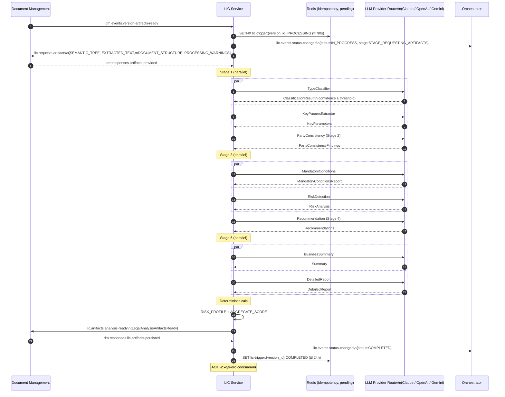

---

## 2. Низкая уверенность классификации (FR-2.1.3)

Соответствует `high-architecture.md` §8.2.

### 2.1 Pause на user confirmation

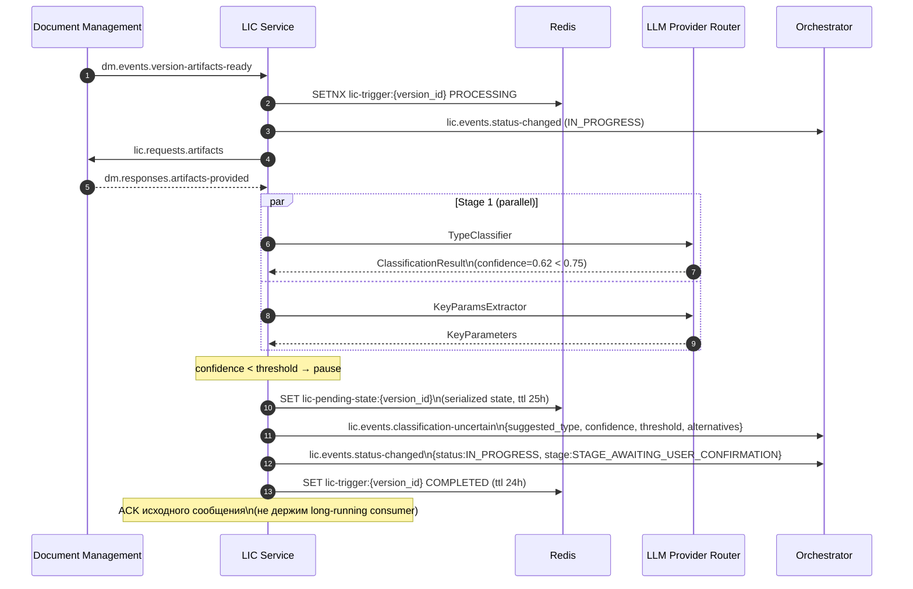

### 2.2 Resume после UserConfirmedType

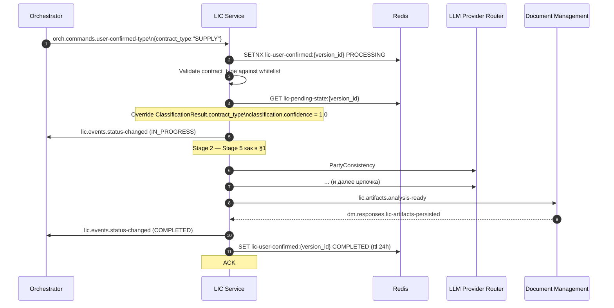

### 2.3 TTL expired до UserConfirmedType

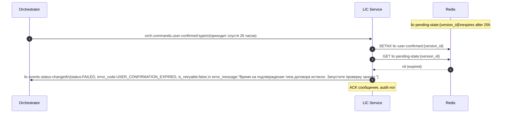

> Прим.: Orchestrator-watchdog (TTL 24h) обычно срабатывает раньше LIC TTL (25h, см. ASSUMPTION-LIC-05) и сам уведомляет пользователя; LIC TTL — safety net на случай watchdog drift.

---

## 3. RE_CHECK — повторная проверка с дельтой рисков

Соответствует `high-architecture.md` §8.3.

```mermaid
sequenceDiagram
    autonumber
    participant DM as Document Management
    participant LIC as LIC Service
    participant Redis as Redis
    participant LLM as LLM Provider Router
    participant Orch as Orchestrator

    Note over DM: Пользователь запросил RE_CHECK\nDM создаёт новую версию version_id=N+1
    DM->>LIC: dm.events.version-created\n{origin_type:"RE_CHECK",\nparent_version_id:N,\nversion_id:N+1}
    LIC->>Redis: SET lic-version-meta:{N+1}\n{origin_type:RE_CHECK, parent_version_id:N}\n(ttl 24h)
    Note over LIC: ACK
    Note over DM: DP обрабатывает; артефакты сохранены
    DM->>LIC: dm.events.version-artifacts-ready\n(version_id=N+1)
    LIC->>Redis: GET lic-version-meta:{N+1}
    Redis-->>LIC: {origin_type:RE_CHECK, parent_version_id:N}
    par Two artifact requests in parallel
        LIC->>DM: lic.requests.artifacts\n(version_id=N+1, types=base set)
        DM-->>LIC: dm.responses.artifacts-provided\n(target artifacts)
    and
        LIC->>DM: lic.requests.artifacts\n(version_id=N, types=[RISK_ANALYSIS])
        DM-->>LIC: dm.responses.artifacts-provided\n(parent RISK_ANALYSIS)
    end
    Note over LIC: Stage 1 — Stage 5 (как в §1)
    LIC->>LLM: ... 8 agents
    Note over LIC: Stage 6 — Risk Delta
    LIC->>LLM: RiskDelta\n(target.risks, parent.risks)
    LLM-->>LIC: RiskDelta result
    LIC->>LIC: RISK_PROFILE + AGGREGATE_SCORE (deterministic)
    LIC->>DM: lic.artifacts.analysis-ready\n+ risk_delta (extension v1.1)
    DM-->>LIC: dm.responses.lic-artifacts-persisted
    LIC->>Orch: lic.events.status-changed (COMPLETED)
```

---

## 4. Ошибка LLM-провайдера (retryable) → fallback

Соответствует `high-architecture.md` §8.4.

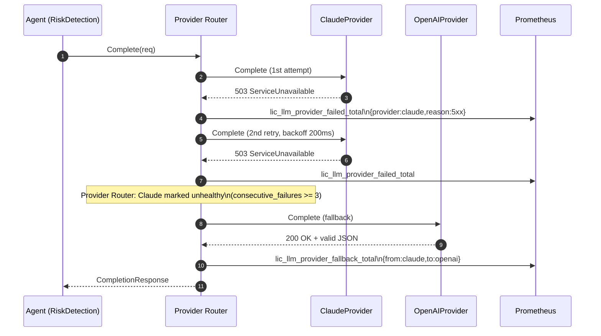

---

## 5. Невалидный JSON → repair loop

Соответствует `high-architecture.md` §8.5.

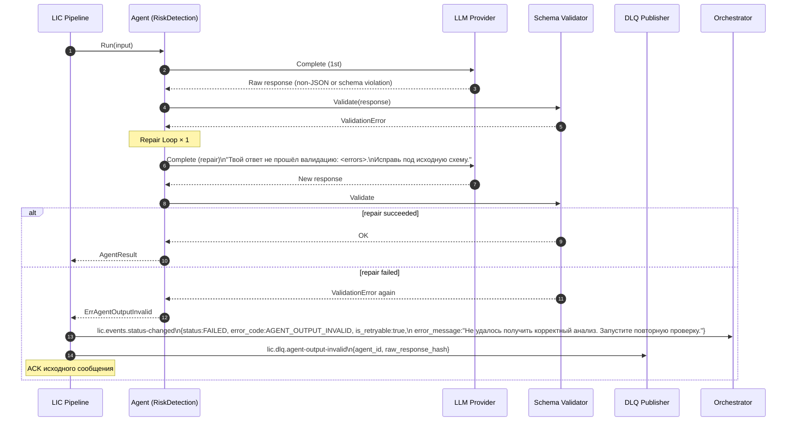

---

## 6. Таймаут DM на запросе артефактов

Соответствует `high-architecture.md` §8.6.

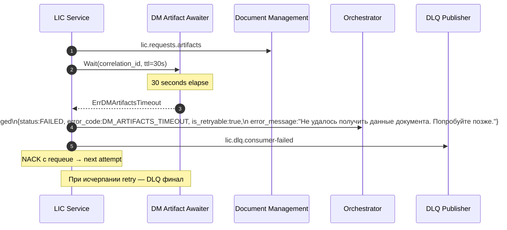

---

## 7. RE_CHECK без родительского RISK_ANALYSIS — graceful degradation

Соответствует `high-architecture.md` §8.7.

```mermaid
sequenceDiagram
    autonumber
    participant LIC as LIC Service
    participant DM as Document Management
    participant LLM as LLM Provider

    Note over LIC: RE_CHECK обнаружен;\nзапрашиваем родительский RISK_ANALYSIS
    LIC->>DM: lic.requests.artifacts\n(version_id=N, types=[RISK_ANALYSIS])
    DM-->>LIC: dm.responses.artifacts-provided\n{artifacts:{}, missing_types:["RISK_ANALYSIS"]}
    Note over LIC: Skip Stage 6 (RiskDelta)\nrisk_delta=null\nadd warning RE_CHECK_PARENT_ANALYSIS_MISSING
    Note over LIC: Stage 1-5 продолжаются\nDetailedReport получает warning
    LIC->>LLM: ... (regular pipeline without RiskDelta)
    LIC->>DM: lic.artifacts.analysis-ready\n(risk_delta absent)
```

---

## 8. DM persist failed (non-retryable)

Соответствует `high-architecture.md` §8.8.

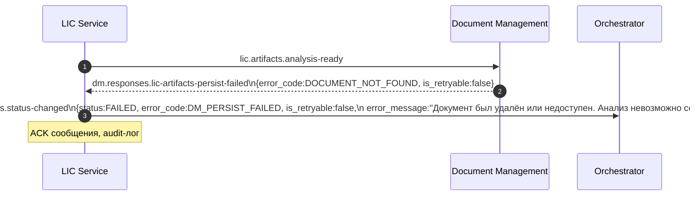

---

## 9. Повторная доставка одного и того же события

Соответствует `high-architecture.md` §8.9.

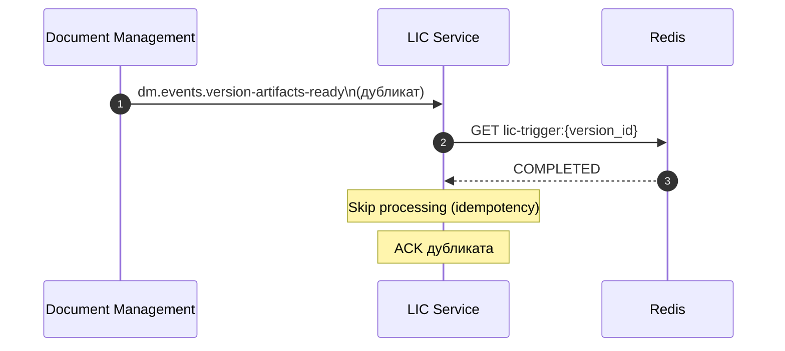

---

## 10. Превышение бюджета времени (timeout pipeline)

Соответствует `high-architecture.md` §8.10.

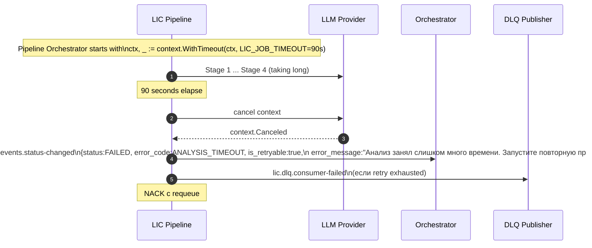

---

## 11. End-to-end: загрузка договора → готовый анализ (контекстная диаграмма)

Иллюстрирует место LIC в общем потоке системы (для понимания границ; реализация — у соответствующих доменов).

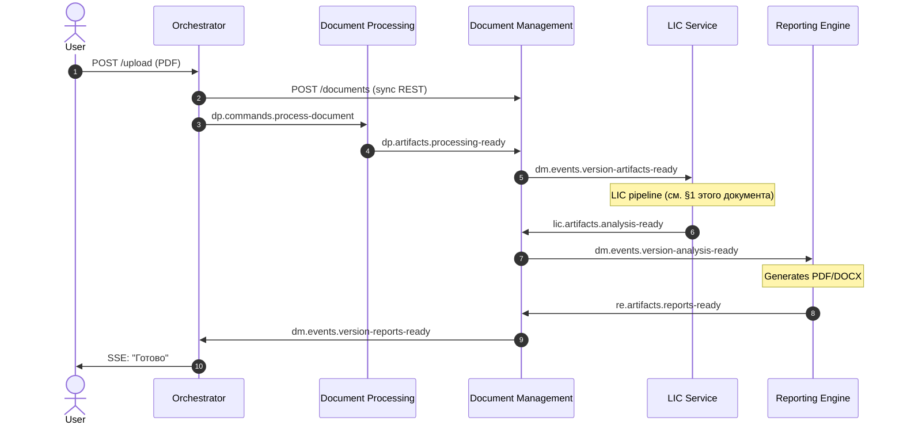

---

## 12. Параллельные стадии в одном инстансе

Иллюстрирует concurrent processing нескольких jobs.

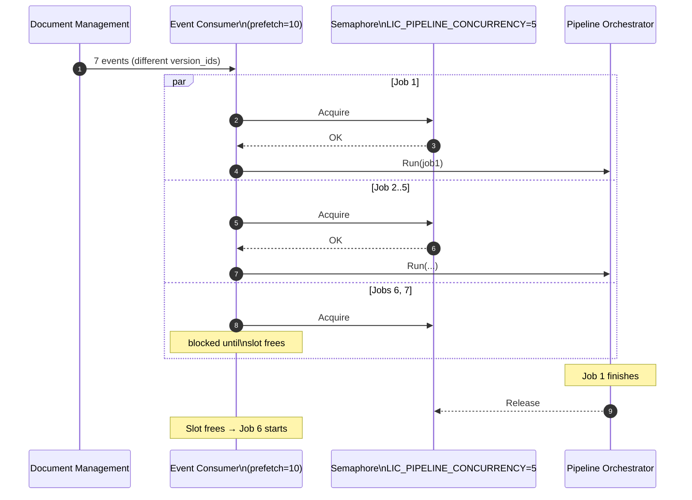

---

## 13. Проверка контрольной суммы ИНН/ОГРН (Pre-LLM step для агента 3)

Иллюстрирует деривативный шаг внутри агента 3 (Party Consistency) — детерминированная проверка контрольных сумм перед LLM-вызовом (для уменьшения галлюцинаций и стоимости).

```mermaid
sequenceDiagram
    autonumber
    participant Agent3 as Party Consistency Agent
    participant Validator as Native INN/OGRN Validator (Go)
    participant Builder as Prompt Builder
    participant LLM as LLM Provider

    Note over Agent3: Получены party_roles из Agent2
    loop for each party
        Agent3->>Validator: ValidateINN(inn) / ValidateOGRN(ogrn)
        Validator-->>Agent3: {valid: bool, entity_type: string|null}
    end
    Agent3->>Builder: BuildPrompt(party_roles, validation_facts, document)
    Builder-->>Agent3: <input> with <validation_facts>
    Agent3->>LLM: Complete
    LLM-->>Agent3: PartyConsistencyFindings\n(LLM использует факты, не валидирует сам)
```

---

## 14. Цикл audit и observability

Иллюстрирует формирование observability-сигналов на ключевых точках пайплайна.

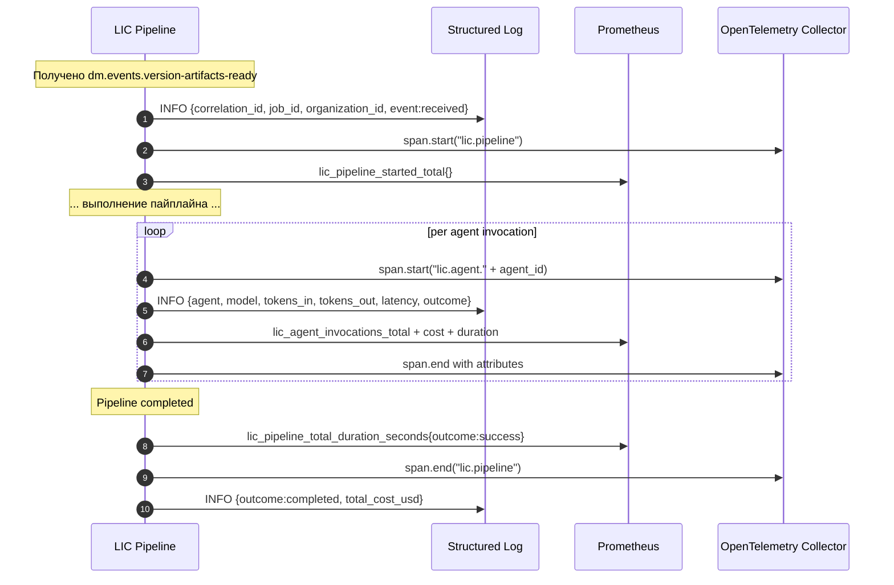
